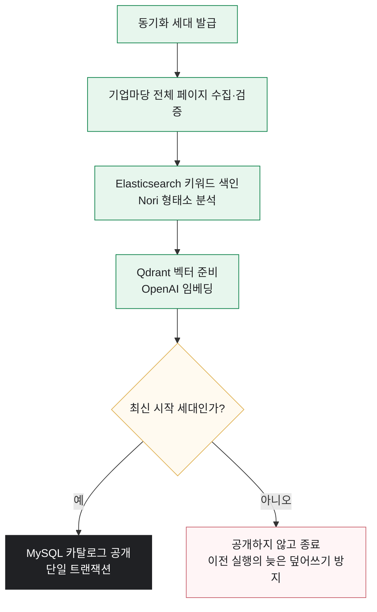
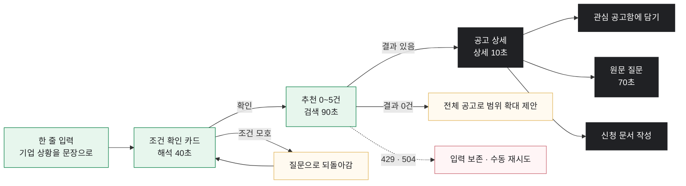

# GovBiz-docs

## 1. 팀 소개

### 👥 팀원 소개

<table>
  <tr>
    <td align="center">
      
    </td>
    <td align="center">
      
    </td>
    <td align="center">
      
    </td>
    <td align="center">
      
    </td>
    <td align="center">
      
    </td>
  </tr>
  <tr>
    <td align="center"><b>김건우</b></td>
    <td align="center"><b>김동섭</b></td>
    <td align="center"><b>이성민</b></td>
    <td align="center"><b>송승재</b></td>
    <td align="center"><b>홍지윤</b></td>
  </tr>
  <tr>
    <td align="center">역할 입력</td>
    <td align="center">역할 입력</td>
    <td align="center">역할 입력</td>
    <td align="center">역할 입력</td>
    <td align="center">역할 입력</td>
  </tr>
  <tr>
    <td align="center">
      
    </td>
    <td align="center">
      
    </td>
    <td align="center">
      
    </td>
    <td align="center">
      
    </td>
    <td align="center">
      
    </td>
  </tr>
</table>

  

## 프로젝트 개요

GovBiz는 여러 정부기관과 공공 플랫폼에 분산된 지원사업 정보를 통합하고, 기업이 자신에게 적합한 사업을 탐색한 뒤 신청을 준비하고 관리할 수 있도록 지원하는 AI 기반 정부지원사업 플랫폼입니다.

기업마당, K-Startup, 과학기술정보통신부 사업공고, 충청남도 온라인수출지원시스템 등 공식 제공처의 공고를 수집·정규화하여 통합 검색 환경을 제공합니다. 사용자는 지역·분야·지원 대상·접수 상태 등의 조건을 직접 선택하는 필터 검색과, 기업의 상황과 지원 목적을 자연어로 설명하는 AI 대화 검색을 함께 이용할 수 있습니다.

AI 대화 검색에서는 사용자의 표현을 검색 조건으로 해석하고, 모호한 내용은 추가 질문을 통해 확인한 후 검색을 수행합니다. 키워드 검색과 의미 기반 검색으로 찾은 공고를 AI가 다시 분석하여 관련도와 추천 이유를 제공하며, 검색 관련도와 실제 신청 자격은 구분하여 표시합니다. 또한 공식 공고 원문을 근거로 신청 조건을 검토하고, 사용자가 공고에 관해 질문하면 인용 가능한 근거와 함께 답변합니다.

검색 이후의 업무도 하나의 흐름으로 연결했습니다. 사용자는 관심 공고를 달력과 목록으로 확인하고, 준비 중·지원 완료·서류 심사·발표 심사·선정·탈락 단계로 진행 상황을 관리할 수 있습니다. 저장된 기업 정보를 바탕으로 맞춤 지원사업 리포트를 확인하거나 정기 이메일을 설정하는 기능도 제공합니다.

신청 단계에서는 공식 공고에 첨부된 PDF·HWP·HWPX 양식을 분석하여 필요한 문항과 입력 정보를 정리하고, 사용자가 확인한 내용을 원본 양식에 반영한 편집 가능한 초안을 만들 수 있습니다. 여러 사업에 동시에 지원하거나 기존 수혜 사업과 겹칠 가능성이 있는 경우에는 공식 자료와 사용자가 입력한 이력을 바탕으로 중복 지원·수혜 제한과 확인이 필요한 사항을 검토합니다.

또한 공고별로 필요한 역량을 갖춘 기업을 모집하고 참여를 제안할 수 있는 파트너 관리 기능을 제공하여, 지원사업 탐색을 기업 간 협업으로 확장했습니다. 계정과 기업 프로필, 검색·작업 기록, 요금제 및 관리자 기능을 함께 구성하여 실제 서비스 운영에 필요한 사용자 환경도 갖추었습니다.

GovBiz는 단순히 지원사업을 추천하는 데서 끝나지 않고, 공고 수집과 탐색, 근거 확인, 신청 준비, 진행 관리, 중복 검토 및 기업 간 협업까지 정부지원사업의 전 과정을 하나의 서비스 안에서 연결하는 것을 목표로 합니다.

  

 

## 차별화 전략

### 1. 기업 상황을 반영하는 AI 대화 검색

단순한 키워드 검색이 아니라 기업의 지역·업종·설립 기간·지원 목적 등을 대화로 입력할 수 있습니다. AI가 부족한 조건을 확인하고 검색 조건을 정리한 뒤 관련 지원사업을 추천합니다.

### 2. 공식 원문 기반의 근거 제공

추천 결과와 자격 조건을 단순한 AI 답변으로 제시하지 않습니다. 공식 공고 원문에서 확인 가능한 문장을 함께 제공해 사용자가 추천 이유와 신청 조건을 직접 검토할 수 있도록 합니다.

### 3. 검색 이후의 신청 준비 지원

공고를 찾은 뒤 신청 문서의 공식 첨부파일을 분석하고, 신청 항목별로 필요한 기업 정보를 정리할 수 있습니다. 사용자가 확인한 정보만 저장하며, 공식 기관에 자동 제출하지 않아 최종 제출 전 검토가 가능합니다.

### 4. 중복 지원·수혜 가능성 검토

여러 지원사업을 동시에 신청하거나 이미 지원받은 사업이 있는 경우 발생할 수 있는 제한 사항을 공고 원문과 사용자가 입력한 참여 정보를 바탕으로 비교·검토합니다.

### 5. 지원사업 중심의 기업 협업

일반적인 기업 매칭이 아니라 특정 지원사업을 기준으로 협업 파트너를 모집하고 제안할 수 있습니다. 공고와 협업 목적을 함께 확인할 수 있어 실제 사업 참여로 이어지는 협업을 지원합니다.

### 6. 비동기 작업과 근거 중심 결과 확인

문서 분석과 중복 검토처럼 시간이 걸리는 작업은 백그라운드에서 처리하고, 사용자가 작업 상태와 결과를 다시 확인할 수 있도록 구성했습니다. AI 결과는 최종 자격이나 선정 결과가 아닌 검토를 돕는 참고 정보로 제공합니다.

 
 
 

## 🛠️ 기술 스택

### Frontend

### Backend · Core API

### AI Service

### Data · Infrastructure

 
 
 

## 🔎인덱싱 단계
### 공고 인덱싱 단계

두 색인이 모두 준비된 뒤에만 해당 제공처가 검색 가능해집니다.
수집·색인에 실패하면 기존 공개 카탈로그를 유지하고 다음 스케줄에서 재시도합니다.
 
 
 

## 주요 기능

| 기능 | 설명 |
|:---:|:---|
| 지원사업 통합 검색 | 여러 공식 제공처의 공고를 AI 대화 검색과 조건별 필터 검색으로 탐색 |
| 근거 기반 공고 분석 | 관련도·추천 이유·신청 조건을 제공하고 공식 공고 원문에 기반한 질의응답 지원 |
| 기업 맞춤 리포트 | 저장된 기업 정보를 기반으로 지원사업을 추천하고 웹·이메일 리포트 제공 |
| 관심 공고 관리 | 관심 공고를 달력과 목록으로 확인하고 신청 진행 단계를 체계적으로 관리 |
| 신청 문서 작성 | 공식 첨부 양식을 분석하고 사용자 답변을 반영한 편집 가능한 신청 문서 초안 생성 |
| 중복 지원·수혜 검토 | 복수 사업의 공식 자료와 지원 이력을 비교하여 제한 및 확인 필요 사항 안내 |
| 파트너 관리 | 공고별 협업 기업 모집과 참여 제안·수락·거절·철회 기능 제공 |

### 서비스 이용 흐름

> 지원사업 탐색 → 근거 및 자격 확인 → 관심 공고 저장 → 신청 준비·진행 관리 → 중복 검토·파트너 협업

## 🖥️화면설계 | **UI 시안/UX Flow**
### 01 지원사업 검색 · `/app/chat`

| 분기 | 조건 | 동작 |
|---|---|---|
| A | 조건이 모호함 | 질문으로 되돌아감 — 확인 전에는 검색하지 않음 |
| B | 결과 0건 | 전체 공고로 범위 확대를 **제안** (자동 실행 아님) |
| C | 429 · 504 | 입력을 보존하고 수동 재시도 버튼만 제공 |
 
 
 
   
## 한 줄 회고

