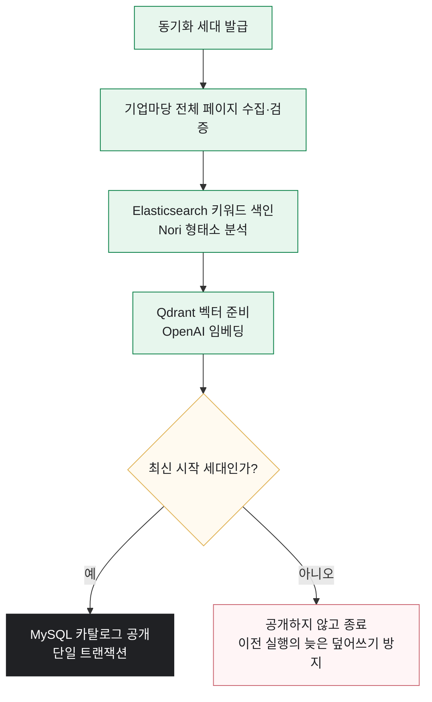

# GovBiz-docs

## 1. 팀 소개

### 👥 팀원 소개
<table>
  <tr>
    <td align="center">
       
      <b>김건우(팀장)</b> 
      <code>infra</code> <code>ai</code> 
      담당 업무 한 줄 설명 
      
    </td>
    <td align="center">
       
      <b>김동섭</b> 
      <code>ai</code> <code>data</code> 
      담당 업무 한 줄 설명 
      
    </td>
    <td align="center">
       
      <b>이성민</b> 
      <code>frontend</code> 
      담당 업무 한 줄 설명 
      
    </td>
    <td align="center">
       
      <b>송승재</b> 
      <code>backend</code> <code>ai</code> 
      담당 업무 한 줄 설명 
      
    </td>
      </a>
    </td>
    <td align="center">
       
      <b>홍지윤</b> 
      <code>backend</code> <code>ai</code> 
      담당 업무 한 줄 설명 
      
    </td>
  </tr>
</table>
 
 

## 2. 프로젝트 개요

정부지원사업은 여러 기관과 플랫폼에 분산되어 있고, 공고마다 신청 조건과 문서 형식이 달라 기업이 적합한 사업을 찾고 준비하는 데 많은 시간과 노력이 필요합니다.

GovBiz는 이러한 문제를 해결하기 위해 공식 제공처의 지원사업 공고를 통합하고, 기업의 상황과 지원 목적에 맞는 사업을 탐색할 수 있도록 만든 AI 기반 정부지원사업 플랫폼입니다. 사용자는 AI 대화 검색과 조건별 필터 검색을 이용할 수 있으며, 공식 공고 원문에 기반한 추천 이유와 신청 조건을 확인할 수 있습니다.

또한 기업 맞춤 리포트, 관심 공고 및 일정 관리, 신청 문서 작성, 중복 지원·수혜 검토, 협업 파트너 모집 기능을 연결하여 지원사업을 찾는 단계부터 검토·신청 준비·진행 관리·기업 간 협업까지 하나의 서비스에서 이어질 수 있도록 구성했습니다.

  

 

## 3. 차별화 전략

### 3-1. 기업 상황을 반영하는 AI 대화 검색

단순한 키워드 검색이 아니라 기업의 지역·업종·설립 기간·지원 목적 등을 대화로 입력할 수 있습니다. AI가 부족한 조건을 확인하고 검색 조건을 정리한 뒤 관련 지원사업을 추천합니다.

### 3-2. 공식 원문 기반의 근거 제공

추천 결과와 자격 조건을 단순한 AI 답변으로 제시하지 않습니다. 공식 공고 원문에서 확인 가능한 문장을 함께 제공해 사용자가 추천 이유와 신청 조건을 직접 검토할 수 있도록 합니다.

### 3-3. 검색 이후의 신청 준비 지원

공고를 찾은 뒤 신청 문서의 공식 첨부파일을 분석하고, 신청 항목별로 필요한 기업 정보를 정리할 수 있습니다. 사용자가 확인한 정보만 저장하며, 공식 기관에 자동 제출하지 않아 최종 제출 전 검토가 가능합니다.

### 3-4. 중복 지원·수혜 가능성 검토

여러 지원사업을 동시에 신청하거나 이미 지원받은 사업이 있는 경우 발생할 수 있는 제한 사항을 공고 원문과 사용자가 입력한 참여 정보를 바탕으로 비교·검토합니다.

### 3-5. 지원사업 중심의 기업 협업

일반적인 기업 매칭이 아니라 특정 지원사업을 기준으로 협업 파트너를 모집하고 제안할 수 있습니다. 공고와 협업 목적을 함께 확인할 수 있어 실제 사업 참여로 이어지는 협업을 지원합니다.

### 3-6. 비동기 작업과 근거 중심 결과 확인

문서 분석과 중복 검토처럼 시간이 걸리는 작업은 백그라운드에서 처리하고, 사용자가 작업 상태와 결과를 다시 확인할 수 있도록 구성했습니다. AI 결과는 최종 자격이나 선정 결과가 아닌 검토를 돕는 참고 정보로 제공합니다.

 
 
 

## 4. 기술 스택

### Frontend

### Backend · Core API

### AI Service

### Data · Infrastructure

 
 
 

## 5. 주요 기능

| 기능 | 설명 |
|:---:|:---|
| 지원사업 통합 검색 | 여러 공식 제공처의 공고를 AI 대화 검색과 조건별 필터 검색으로 탐색 |
| 근거 기반 공고 분석 | 관련도·추천 이유·신청 조건을 제공하고 공식 공고 원문에 기반한 질의응답 지원 |
| 기업 맞춤 리포트 | 저장된 기업 정보를 기반으로 지원사업을 추천하고 웹·이메일 리포트 제공 |
| 관심 공고 관리 | 관심 공고를 달력과 목록으로 확인하고 신청 진행 단계를 체계적으로 관리 |
| 신청 문서 작성 | 공식 첨부 양식을 분석하고 사용자 답변을 반영한 편집 가능한 신청 문서 초안 생성 |
| 중복 지원·수혜 검토 | 복수 사업의 공식 자료와 지원 이력을 비교하여 제한 및 확인 필요 사항 안내 |
| 파트너 관리 | 공고별 협업 기업 모집과 참여 제안·수락·거절·철회 기능 제공 |

 
 

## 6. 인덱싱 단계
### 공고 인덱싱 단계

두 색인이 모두 준비된 뒤에만 해당 제공처가 검색 가능해집니다.
수집·색인에 실패하면 기존 공개 카탈로그를 유지하고 다음 스케줄에서 재시도합니다.
 
 
 

## 7. 주요 기능

| 기능 | 설명 |
|:---:|:---|
| 지원사업 통합 검색 | 여러 공식 제공처의 공고를 AI 대화 검색과 조건별 필터 검색으로 탐색 |
| 근거 기반 공고 분석 | 관련도·추천 이유·신청 조건을 제공하고 공식 공고 원문에 기반한 질의응답 지원 |
| 기업 맞춤 리포트 | 저장된 기업 정보를 기반으로 지원사업을 추천하고 웹·이메일 리포트 제공 |
| 관심 공고 관리 | 관심 공고를 달력과 목록으로 확인하고 신청 진행 단계를 체계적으로 관리 |
| 신청 문서 작성 | 공식 첨부 양식을 분석하고 사용자 답변을 반영한 편집 가능한 신청 문서 초안 생성 |
| 중복 지원·수혜 검토 | 복수 사업의 공식 자료와 지원 이력을 비교하여 제한 및 확인 필요 사항 안내 |
| 파트너 관리 | 공고별 협업 기업 모집과 참여 제안·수락·거절·철회 기능 제공 |

### 8. 서비스 이용 흐름

> 지원사업 탐색 → 근거 및 자격 확인 → 관심 공고 저장 → 신청 준비·진행 관리 → 중복 검토·파트너 협업
 
 

## 9. 화면설계 | **UI 시안/UX Flow**

 

## 10. 주요 문서

| 목적 | 문서 |
|---|---|
| 서비스·정책 | ※ 프로젝트 개요, ※ MVP 범위, ※ 안전·적응 정책 — 현재 없음 (신규 작성 필요) |
| 설계·계약 | [아키텍처 README](../docs/architecture/README.md) · [서비스 호출·데이터 흐름](../docs/architecture.md) · [기술 스택·데이터 구성](../docs/technology.md) · [지원사업 검색 API 계약](../docs/support-program-search-contract.md) · [계정·인증 계약](../docs/account-auth-contract.md) · [SampleItem 계약 예시](../docs/sample-item-contract.md) |
| 평가 계획·결과 | [검색 평가 도구](../evaluation/support-program-search/README.md) · [실데이터 평가 결과](../evaluation/support-program-search/runs/support-program-catalog-20260906-v1/README.md) · [Elasticsearch 비교 실험](../evaluation/support-program-search/elasticsearch/README.md) · [RAG 감사·답변 평가](../evaluation/support-program-evidence/README.md) · [중복 검토 근거·사례](../evaluation/combination-review/README.md) · [판정·리뷰 도구](../evaluation/support-program-search/review/README.md) |
| 개발·배포 | [Compose 실행·검증](../infrastructure/README.md) · [Frontend 개발](../frontend/README.md) · [Core API 개발](../backend/core-api/README.md) · [AI Service 개발](../backend/ai-service/README.md) · [커스터마이징 가이드](../docs/customization-guide.md) |
| 개인정보 운영 | [RabbitMQ 카카오 연결 해제](../docs/rabbitmq-account-oauth-unlink.md) — 현재 유일한 개인정보 처리 문서. ※ "계정 삭제 절차" 단독 문서는 없음 |
| 변경 이력·협업 | [기획 정합성·개발 백로그](../docs/development-strategy-20260907.md) · [기획 정합성 리뷰](../docs/project-review-20260907.md) · [구현 현황](../docs/implementation-status.md) — ※ ADR 목록·협업 가이드는 없음 |
 
 

   
## 11. 한 줄 회고

**김건우**
> 한 줄 회고를 입력해주세요.

**김동섭**
> 한 줄 회고를 입력해주세요.

**송승재**
> 한 줄 회고를 입력해주세요.

**이성민**
> 한 줄 회고를 입력해주세요.

**홍지윤**
> 한 줄 회고를 입력해주세요.
