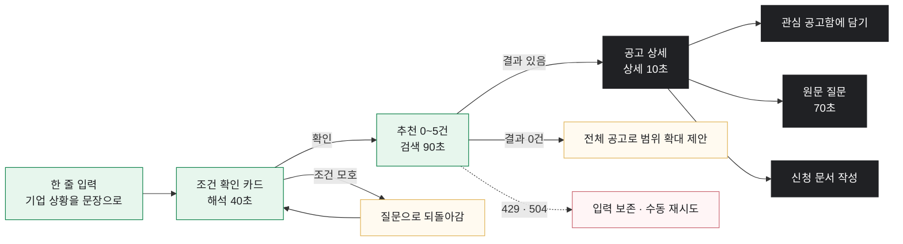

# GovBiz-docs

## 팀 소개
| 이름 | 역할 | GitHub |
|--- | --- | --- |
| 김건우 | 역할 |  |
| 김동섭 | 역할 |  |
| 송승재 | 역할 |  |
| 이성민 | 역할 | |
| 홍지윤 | 역할 |  |

## 프로젝트 개요(차별화 전략)
정부지원사업 검색부터 신청 준비와 기업 간 협업까지 돕는 AI 웹 서비스입니다.
기업마당·K-Startup 등 공식 공고를 기반으로 지원사업 추천, 원문 근거 확인, 신청 정보 정리와 협업 모집·제안을 지원합니다.

### 차별화 전략
- **AI 대화 검색**: 키워드가 아니라 회사 상황을 대화로 설명하면 조건을 반영해 추천
- **원문 근거 인용**: 추천 이유·자격 여부를 공식 공고 원문의 실제 문장으로 인용해 신뢰도 확보
- **중복 지원·수혜 검토**: 이미 받은 지원과 겹치는 공고인지 자동 분석
- **파트너 모집**: 공고 단위로 협업 파트너를 모집·제안할 수 있는 기능까지 포함

## 🛠️기술스택
> Frontend

> Backend (Core API)

- MyBatis 4.0.0, Flyway (스키마 버전 관리)
- jsoup 1.23.2 (원문 파싱)
- spring-security-crypto (BCrypt 비밀번호 해시)

> AI Service

- OpenAI SDK 3.x, Agents SDK 0.22.x, tiktoken

> 데이터·인프라

- Qdrant 1.17.1 (의미 검색 벡터)

> 외부 API
- 공공데이터포털 기업마당 API
- Bizno 사업자등록번호 조회 API
- OpenAI (gpt-5.6-luna 기본, 랭킹은 gpt-5.6-sol, 임베딩은 text-embedding-3-small)

-------

## 🛠 기술스택

### Frontend

### Backend (Core API)

MyBatis 4.0.0 · Flyway · jsoup 1.23.2 · spring-security-crypto (BCrypt)

### AI Service

Agents SDK 0.22.x · tiktoken

### 데이터 · 인프라

Qdrant 1.17.1 (의미 검색 벡터)

### 외부 API

공공데이터포털 기업마당 API · Bizno 사업자등록번호 조회 API · OpenAI (gpt-5.6-luna · 랭킹 gpt-5.6-sol · 임베딩 text-embedding-3-small)

## 🛠 기술스택

| 구분 | 기술 |
|---|---|
| **Frontend** |        |
| **Backend** (Core API) |   MyBatis 4.0.0 · Flyway · jsoup 1.23.2 · spring-security-crypto(BCrypt) |
| **AI Service** |    Agents SDK 0.22.x · tiktoken |
| **데이터·인프라** |     Qdrant 1.17.1 (의미 검색 벡터) |
| **외부 API** | 공공데이터포털 기업마당 API · Bizno 사업자등록번호 조회 API · OpenAI (gpt-5.6-luna · 랭킹 gpt-5.6-sol · 임베딩 text-embedding-3-small) |

## 🔎인덱싱 단계
동기화 세대 발급
   → 기업마당 전체 페이지 수집·검증
   → Elasticsearch 키워드 색인 (Nori 형태소 분석)
   → Qdrant 벡터 준비 (OpenAI 임베딩)
   → 최신 시작 세대인지 확인
   → MySQL 카탈로그를 하나의 트랜잭션으로 공개

## 🖥️화면설계 (간단하게) **UI 시안/UX Flow**
### 01 지원사업 검색 · `/app/chat`

| 분기 | 조건 | 동작 |
|---|---|---|
| A | 조건이 모호함 | 질문으로 되돌아감 — 확인 전에는 검색하지 않음 |
| B | 결과 0건 | 전체 공고로 범위 확대를 **제안** (자동 실행 아님) |
| C | 429 · 504 | 입력을 보존하고 수동 재시도 버튼만 제공 |

   
## 한 줄 회고
