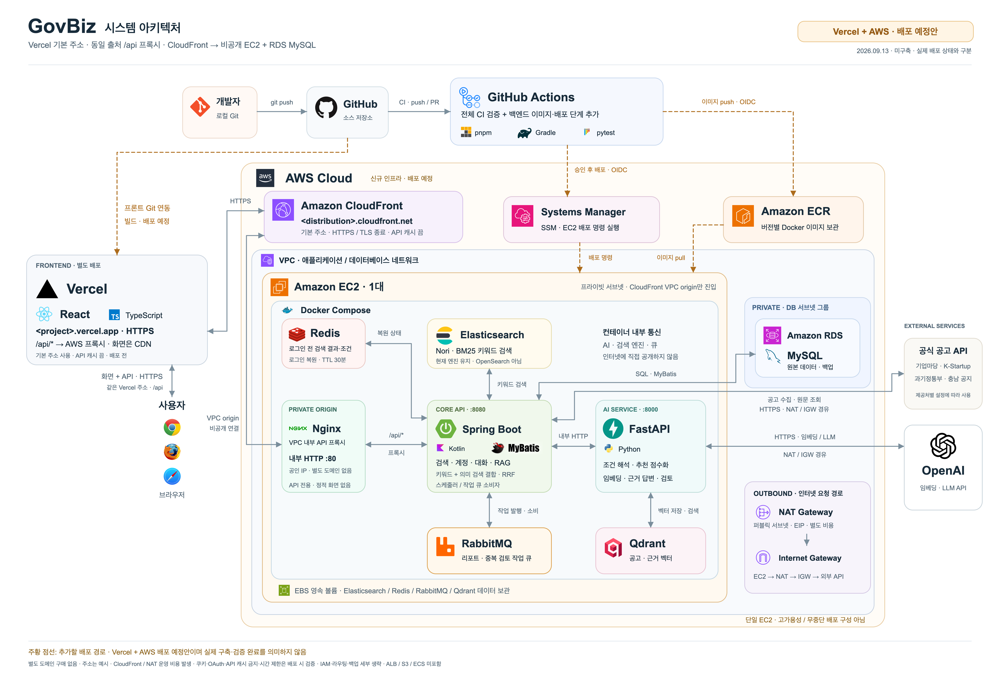
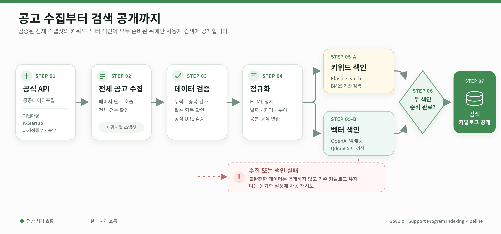

# GovBiz-docs


## 1. 팀 소개

### 👥 팀원 소개
<table>
  <tr>
    <td align="center">
      <br>
      <b>김건우(팀장)</b><br>
      <a href="https://github.com/ilil1">
        
      </a>
    </td>
    <td align="center">
      <br>
      <b>김동섭</b><br>
      <a href="https://github.com/kimdongseop">
        
      </a>
    </td>
    <td align="center">
      <br>
      <b>이성민</b><br>
      <a href="https://github.com/sungmin">
        
      </a>
    </td>
    <td align="center">
      <br>
      <b>송승재</b><br>
      <a href="https://github.com/Genus-Jae">
        
      </a>
    </td>
      </a>
    </td>
    <td align="center">
      <br>
      <b>홍지윤</b><br>
      <a href="https://github.com/JiYoon241111">
        
      </a>
    </td>
  </tr>
</table>
<br>
<br>

# 2. 프로젝트 개요

# 🏛️ GovBiz

### AI 기반 정부지원사업 탐색·신청 관리 플랫폼

## 📢 프로젝트 소개

GovBiz는 여러 정부기관과 공공 플랫폼에 분산된 지원사업 공고를 통합하고, 기업이 자신에게 적합한 사업을 탐색한 뒤 신청 준비와 진행 관리까지 이어갈 수 있도록 지원하는 AI 기반 정부지원사업 플랫폼입니다.

기업마당·K-Startup·과학기술정보통신부·충청남도 온라인수출지원시스템 등 공식 제공처의 공고를 수집·정규화하여 통합 검색 환경을 제공합니다. 사용자는 조건별 필터 검색과 AI 대화 검색을 통해 공고를 탐색하고, 공식 원문에 기반한 추천 이유와 신청 조건을 확인할 수 있습니다.

검색한 공고는 관심 공고함에 저장해 달력·목록으로 일정을 확인하고, 준비 중·지원 완료·서류 심사·발표 심사·선정·탈락 단계로 진행 상황을 관리할 수 있습니다. 또한 신청 문서 작성, 중복 지원·수혜 가능성 검토, 협업 파트너 모집과 제안 등의 기능을 통해 지원사업의 전 과정을 하나의 서비스에서 관리할 수 있도록 구성했습니다.

## 🏢 프로젝트 필요성

- 정부지원사업 정보가 여러 기관과 공공 플랫폼에 분산되어 있어 기업이 적합한 공고를 찾는 데 많은 시간과 노력이 필요합니다.
- 공고마다 문서 형식과 표현 방식이 달라 신청 자격, 지원 내용, 접수 기간 등의 핵심 정보를 비교하기 어렵습니다.
- 키워드 중심 검색만으로는 기업의 지역·업종·설립 기간·지원 목적과 같은 구체적인 상황을 충분히 반영하기 어렵습니다.
- AI가 생성한 추천 결과만 제공할 경우 정보의 정확성과 신뢰성을 사용자가 직접 검증하기 어렵습니다.
- 공고를 찾은 이후에도 신청 일정, 작성 문서, 심사 단계 등을 별도로 관리해야 하므로 업무가 단절될 수 있습니다.
- 여러 사업에 지원하거나 기존 수혜 이력이 있는 경우 중복 지원 제한 여부를 개별적으로 확인해야 합니다.
- 특정 지원사업에 공동으로 참여할 기업을 찾고 협업을 제안할 수 있는 연결 수단이 부족합니다.

## 🎯 프로젝트 목표

1. 여러 공식 제공처의 지원사업 공고를 수집·정규화하고 하나의 서비스에서 검색할 수 있는 통합 환경을 구축합니다.
2. 키워드 검색과 의미 기반 검색을 결합하여 사용자의 기업 상황과 지원 목적에 적합한 공고를 탐색합니다.
3. AI 대화 검색을 통해 모호한 요청은 추가 질문으로 구체화하고, 확인된 조건을 바탕으로 관련 공고를 추천합니다.
4. 추천 이유와 신청 조건을 공식 공고 원문에 기반해 제공하고, 검색 관련도와 실제 신청 자격을 구분하여 안내합니다.
5. 관심 공고를 달력과 목록으로 확인하고, 지원완료부터 심사·선정·탈락까지 신청 진행 단계를 체계적으로 관리합니다.
6. 공식 첨부 양식을 분석하여 필요한 항목을 정리하고, 사용자 정보를 반영한 편집 가능한 신청 문서 초안을 생성합니다.
7. 사용자의 지원·수혜 이력과 공고 자료를 비교하여 중복 지원 제한 및 추가 확인이 필요한 사항을 검토합니다.
8. 지원사업별 협업 파트너 모집과 참여 제안 기능을 제공하여 공고 탐색을 실제 기업 간 협업으로 연결합니다.

## ✨ 차별화 전략

### 검색부터 신청 이후까지 연결하는 통합 워크플로우

기존 지원사업 서비스가 공고 검색과 추천에 집중한다면, GovBiz는 공고 탐색 이후의 과정까지 하나의 흐름으로 연결합니다. 사용자는 관심 공고를 저장하고 접수 일정을 확인하며, 신청 문서를 준비하고 심사 결과까지 단계별로 관리할 수 있습니다.

> 지원사업 검색 → 근거·자격 확인 → 관심 공고 저장 → 신청 문서 작성 → 진행 단계 관리

### 공식 원문을 기반으로 검증할 수 있는 AI

AI가 생성한 답변만 제공하지 않고, 추천 이유와 신청 조건을 공식 공고 원문에서 확인할 수 있도록 근거를 함께 제시합니다. 검색 결과와 실제 신청 자격을 구분하여 사용자가 AI의 판단을 직접 검토할 수 있도록 설계했습니다.

> 단순 AI 추천이 아닌, 공식 원문을 통해 확인할 수 있는 근거 중심의 지원사업 분석

### 일회성 검색이 아닌 기업 맞춤형 지속 관리

기업의 지역·업종·설립 기간·지원 목적을 반영한 AI 대화 검색과 조건별 필터 검색을 함께 제공합니다. 저장된 기업 정보를 기반으로 맞춤 지원사업 리포트를 생성하고 이메일로도 제공하여, 사용자가 매번 새로운 공고를 직접 검색해야 하는 부담을 줄입니다.

> 사용자가 공고를 반복해서 찾는 방식에서 기업에 맞는 공고를 지속적으로 관리하는 방식으로 확장

### 지원사업 참여의 위험과 협업까지 지원

여러 사업에 동시에 지원하거나 기존 수혜 사업이 있는 경우 공식 자료와 지원 이력을 비교하여 중복 지원·수혜 제한 가능성을 안내합니다. 또한 특정 공고를 기준으로 협업 기업을 모집하고 참여를 제안할 수 있어, 단독 신청뿐 아니라 기업 간 공동 참여까지 지원합니다.

> 공고 추천을 넘어 중복 위험 검토와 사업 중심의 기업 협업까지 지원

### 🔎 서비스 한눈에 보기

<table>
  <thead>
    <tr>
      <th width="180">구분</th>
      <th>내용</th>
    </tr>
  </thead>
  <tbody>
    <tr>
      <td><b>서비스명</b></td>
      <td>GovBiz</td>
    </tr>
    <tr>
      <td><b>서비스 정의</b></td>
      <td>정부지원사업 탐색부터 신청 준비와 협업까지 연결하는 AI 기반 플랫폼</td>
    </tr>
    <tr>
      <td><b>주요 사용자</b></td>
      <td>정부지원사업을 찾고 신청하려는 기업 및 사업 담당자</td>
    </tr>
    <tr>
      <td><b>검색 방식</b></td>
      <td>AI 대화 검색과 지역·분야·지원 대상 등을 선택하는 필터 검색</td>
    </tr>
    <tr>
      <td><b>핵심 기능</b></td>
      <td>통합 검색, 공고 분석, 맞춤 리포트, 관심 공고 관리, 신청 문서 작성, 중복 검토, 파트너 관리</td>
    </tr>
    <tr>
      <td><b>데이터 출처</b></td>
      <td>기업마당, K-Startup, 과학기술정보통신부, 충청남도 온라인수출지원시스템</td>
    </tr>
    <tr>
      <td><b>신뢰성 원칙</b></td>
      <td>공식 공고 원문과 확인 가능한 근거를 함께 제공</td>
    </tr>
    <tr>
      <td><b>서비스 흐름</b></td>
      <td>탐색 → 조건 확인 → 관심 공고 저장 → 신청 준비 → 진행 관리 → 협업</td>
    </tr>
  </tbody>
</table>
<br>
<br>

## 3. 기술 스택

### Frontend


### Backend · Core API


### AI Service


### Data · Infrastructure


<br>
<br>
<br>

## 4. 주요 기능

| 기능 | 설명 |
|:---:|:---|
| 지원사업 통합 검색 | 여러 공식 제공처의 공고를 AI 대화 검색과 조건별 필터 검색으로 탐색 |
| 근거 기반 공고 분석 | 관련도·추천 이유·신청 조건을 제공하고 공식 공고 원문에 기반한 질의응답 지원 |
| 기업 맞춤 리포트 | 저장된 기업 정보를 기반으로 지원사업을 추천하고 웹·이메일 리포트 제공 |
| 관심 공고 관리 | 관심 공고를 달력과 목록으로 확인하고 신청 진행 단계를 체계적으로 관리 |
| 신청 문서 작성 | 공식 첨부 양식을 분석하고 사용자 답변을 반영한 편집 가능한 신청 문서 초안 생성 |
| 중복 지원·수혜 검토 | 복수 사업의 공식 자료와 지원 이력을 비교하여 제한 및 확인 필요 사항 안내 |
| 파트너 관리 | 공고별 협업 기업 모집과 참여 제안·수락·거절·철회 기능 제공 |

### 4-1. 서비스 이용 흐름

> 지원사업 탐색 → 근거 및 자격 확인 → 관심 공고 저장 → 신청 준비·진행 관리 → 중복 검토·파트너 협업 
<br>
<br>


## 5. 시스템 아키텍처

<p align="center">
  
</p>

## 📌 서비스 구성 및 운영 흐름

GovBiz는 Vercel과 AWS 환경에 배포할 수 있도록 프론트엔드, Core API, AI Service, 데이터 저장소를 분리하여 구성했습니다.

1. 사용자는 웹 브라우저를 통해 Vercel에 배포되는 React 프론트엔드에 접속합니다.
2. 프론트엔드의 `/api` 요청은 CloudFront를 거쳐 VPC 내부의 Nginx로 전달됩니다.
3. Nginx는 요청을 Spring Boot 기반 Core API로 프록시합니다.
4. Core API는 계정, 공고 검색, 관심 공고, 신청 관리 등 주요 업무를 처리합니다.
5. 대화 검색과 공고 분석이 필요한 요청은 FastAPI 기반 AI Service로 전달합니다.
6. 공고와 사용자 데이터는 Amazon RDS MySQL에 저장합니다.
7. Elasticsearch와 Qdrant는 키워드·의미 기반 검색에, Redis와 RabbitMQ는 상태 관리와 비동기 작업 처리에 활용합니다.
8. 공고 데이터는 공공데이터포털 Open API에서 수집하며, AI 기능은 OpenAI API와 연동합니다.

## 📌 배포 흐름

- GitHub에 코드가 반영되면 GitHub Actions가 프론트엔드, Core API, AI Service의 테스트와 빌드를 검증합니다.
- 백엔드 Docker 이미지는 OIDC 인증을 통해 Amazon ECR에 저장합니다.
- AWS Systems Manager가 EC2에 배포 명령을 전달하면 최신 이미지를 내려받아 Docker Compose 서비스를 실행합니다.
- 프론트엔드는 GitHub와 연동된 Vercel에서 별도로 빌드·배포합니다.
- 외부 요청은 CloudFront를 통해 전달하고, EC2와 RDS는 VPC 내부 네트워크에 배치합니다.

## 📌 로컬 개발 환경

- Docker Compose를 이용해 Nginx, Spring Boot, FastAPI, MySQL, Elasticsearch, Qdrant, Redis, RabbitMQ를 함께 실행합니다.
- 팀원은 동일한 컨테이너 구성으로 공고 수집부터 검색, AI 분석, 비동기 작업까지 전체 서비스 흐름을 재현할 수 있습니다.
- 로컬 환경과 배포 환경은 환경변수로 외부 API, 데이터베이스 및 서비스 연결 정보를 구분합니다.

<br>
<br>

## 6. ERD


<br>
<br>

## 7. 📊 데이터 준비

GovBiz는 기업마당·K-Startup·과학기술정보통신부·충청남도 온라인수출지원시스템 등 여러 공식 제공처에 분산된 정부지원사업 공고를 수집하여 활용합니다. 제공처마다 다른 데이터 형식과 분류 기준을 공통 구조로 정규화하고, 키워드 검색과 의미 기반 검색에 사용할 수 있도록 색인합니다.

### 1) 데이터 출처

| 제공처 | 주요 데이터 | 수집 방식 |
|---|---|---|
| 기업마당 | 중앙부처·지자체·공공기관의 기업지원사업 공고 | 공공데이터포털 Open API |
| K-Startup | 창업기업 대상 지원사업 공고 | 공공데이터포털 Open API |
| 과학기술정보통신부 | 과학기술·연구개발 관련 사업 공고 | 공공데이터포털 Open API |
| 충청남도 온라인수출지원시스템 | 충청남도 기업 대상 수출지원사업 공고 | 공공데이터포털 Open API |

수집한 데이터는 검색과 자격 검토에 활용할 수 있도록 공고 제목, 주관기관, 신청 기간, 지원 지역, 지원 분야, 지원 대상, 공고 내용, 원문 URL 등의 항목으로 관리합니다.

### 2) 데이터 수집 및 정규화

제공처마다 서로 다른 필드명과 날짜·지역·분야 표현을 GovBiz의 공통 데이터 구조로 변환합니다.

- 제공처 코드와 원본 공고 ID를 조합하여 공고 식별
- 공고 제목과 주관기관명 정리
- 접수 시작일과 마감일 형식 통일
- 지역·지원 분야·지원 대상 분류 정규화
- 원문 URL과 첨부파일 정보 보존
- 필수 항목 및 전체 수집 건수 검증
- 동일 공고 재수집 시 기존 데이터를 갱신
- 제공처 수집 실패 시 기존 공개 데이터를 유지

접수 상태는 고정된 값으로 저장하지 않고, 신청 기간과 현재 날짜를 기준으로 계산하여 `접수 예정`, `접수 중`, `접수 마감`으로 제공합니다.

### 3) 검색 데이터 구성

정규화가 완료된 공고는 서로 다른 검색 방식에 맞게 두 가지 형태로 색인합니다.

| 저장·검색 영역 | 활용 목적 |
|---|---|
| MySQL | 정규화된 공고 정보와 현재 공개 상태 관리 |
| Elasticsearch | 공고명·기관명·본문을 이용한 키워드 검색 |
| Qdrant | 공고 내용을 임베딩한 의미 기반 검색 |
| 원문 및 첨부파일 | 신청 조건 확인과 근거 기반 질의응답 |

Elasticsearch의 키워드 검색 결과와 Qdrant의 의미 기반 검색 결과를 결합하여 후보 공고를 찾고, AI가 사용자의 기업 상황 및 요청과의 관련성을 분석합니다.

### 4) 데이터 활용

수집·정규화된 공고 데이터는 다음 기능에 공통으로 활용됩니다.

- AI 대화 검색과 조건별 필터 검색
- 공고별 추천 이유와 신청 조건 확인
- 공식 원문 기반 공고 질의응답
- 기업 정보를 활용한 맞춤 지원사업 리포트
- 관심 공고의 접수 일정 및 진행 단계 관리
- 신청 문서의 항목과 첨부 양식 분석
- 중복 지원·수혜 제한 가능성 검토
- 지원사업별 협업 파트너 모집 및 제안
<br>
<br>

## 8. 공고 인덱싱 과정
### 공고 인덱싱 단계

<br>
<br>

## 9. 화면설계 | **UI 시안/UX Flow**

<br>
<br>

## 10. 폴더 구조
## 프로젝트 폴더 구조

```text
GovBiz/
├── backend/
│   ├── core-api/                    # Kotlin·Spring Boot Core API
│   └── ai-service/                  # Python·FastAPI AI Service
├── frontend/                        # React·TypeScript 웹 애플리케이션
├── evaluation/
│   ├── assistant/                   # AI 어시스턴트 평가
│   ├── combination-review/          # 중복 지원·수혜 검토 평가
│   ├── support-program-evidence/    # 공고 근거 답변 평가
│   └── support-program-search/      # 검색 품질·성능 평가
├── infrastructure/
│   ├── codebuild/                   # AWS CodeBuild 설정
│   ├── document-mcp/                # 신청 문서 생성 환경
│   ├── elasticsearch/               # 키워드 검색 설정
│   ├── nginx/                       # API 프록시 설정
│   ├── scripts/                     # 실행·검증 스크립트
│   ├── seed/                        # 시연용 초기 데이터
│   ├── stubs/                       # 외부 API 테스트 서버
│   ├── compose.yaml                 # 로컬 실행 설정
│   └── compose.prod.yaml            # 배포 환경 설정
├── docs/
│   ├── architecture/                # 시스템 구조 문서
│   ├── assets/                      # README 이미지 리소스
│   └── *.md                         # 기능 설계·API 계약 문서
├── .github/                         # GitHub Actions CI 설정
├── .env.example                     # 환경변수 작성 예시
└── README.md                        # 프로젝트 안내 문서
```

각 폴더는 서비스 운영에 필요한 핵심 영역을 기준으로 구성되어 있습니다. 로컬 캐시, 가상환경, 임시 파일과 같은 개발 환경 전용 항목은 구조에서 제외했습니다.
<br>
<br>

## 11. 주요 문서

| 목적 | 문서 |
|---|---|
| 서비스·정책 | ※ 프로젝트 개요, ※ MVP 범위, ※ 안전·적응 정책 — 현재 없음 (신규 작성 필요) |
| 설계·계약 | [아키텍처 README](../docs/architecture/README.md) · [서비스 호출·데이터 흐름](../docs/architecture.md) · [기술 스택·데이터 구성](../docs/technology.md) · [지원사업 검색 API 계약](../docs/support-program-search-contract.md) · [계정·인증 계약](../docs/account-auth-contract.md) · [SampleItem 계약 예시](../docs/sample-item-contract.md) |
| 평가 계획·결과 | [검색 평가 도구](../evaluation/support-program-search/README.md) · [실데이터 평가 결과](../evaluation/support-program-search/runs/support-program-catalog-20260906-v1/README.md) · [Elasticsearch 비교 실험](../evaluation/support-program-search/elasticsearch/README.md) · [RAG 감사·답변 평가](../evaluation/support-program-evidence/README.md) · [중복 검토 근거·사례](../evaluation/combination-review/README.md) · [판정·리뷰 도구](../evaluation/support-program-search/review/README.md) |
| 개발·배포 | [Compose 실행·검증](../infrastructure/README.md) · [Frontend 개발](../frontend/README.md) · [Core API 개발](../backend/core-api/README.md) · [AI Service 개발](../backend/ai-service/README.md) · [커스터마이징 가이드](../docs/customization-guide.md) |
| 개인정보 운영 | [RabbitMQ 카카오 연결 해제](../docs/rabbitmq-account-oauth-unlink.md) — 현재 유일한 개인정보 처리 문서. ※ "계정 삭제 절차" 단독 문서는 없음 |
| 변경 이력·협업 | [기획 정합성·개발 백로그](../docs/development-strategy-20260907.md) · [기획 정합성 리뷰](../docs/project-review-20260907.md) · [구현 현황](../docs/implementation-status.md) — ※ ADR 목록·협업 가이드는 없음 |
<br>
<br>

## 12.주요 문서

| 분류 | 문서 | 내용 |
| --- | --- | --- |
| 시스템 | [시스템 아키텍처](docs/architecture.md) | 전체 시스템 구성과 서비스 간 연결 구조 |
| 기술 | [기술 구성](docs/technology.md) | 기술 스택과 주요 구현 방식 |
| 구현 | [구현 현황](docs/implementation-status.md) | 기능별 구현·검증 상태 |
| 검색 | [지원사업 검색 설계](docs/support-program-search-contract.md) | AI 검색 흐름과 공고 데이터 계약 |
| 신청 | [신청 준비 설계](docs/application-preparation-design.md) | 신청 양식 분석과 문서 작성 과정 |
| 검토 | [중복 지원·수혜 검토](docs/duplicate-support-review-design.md) | 복수 사업 비교 및 제한 검토 구조 |
| 배포 | [AWS·Vercel 배포](docs/deployment-aws-vercel.md) | 배포 아키텍처와 운영 절차 |
| 기획 | [프로젝트 사업계획서](docs/govbiz-business-plan-v3.pdf) | 서비스 기획과 비즈니스 모델 |
<br>
<br>

## 13. 수행 결과
<br>
<br>

## 14. 한 줄 회고

**김건우**
> 한 줄 회고를 입력해주세요.

**김동섭**
> 한 줄 회고를 입력해주세요.

**송승재**
> 한 줄 회고를 입력해주세요.

**이성민**
> 한 줄 회고를 입력해주세요.

**홍지윤**
> 한 줄 회고를 입력해주세요.
