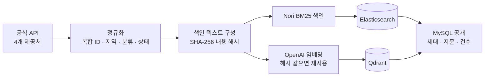
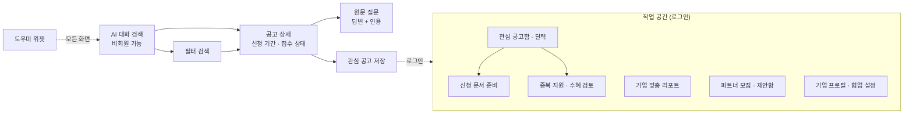

# GovBiz

**정부지원사업 공고를 찾고, 자격을 원문으로 확인하고, 신청 서류까지 준비하는 AI 웹 서비스**

SK네트웍스 Family AI 캠프 34기 · 3차 프로젝트(LLM 연동 문서 기반 질의응답) · 1팀 · 2026-09-02 ~ 2026-09-14

## 2. 프로젝트 개요

### 소개

기업마당 · K-Startup · 과학기술정보통신부 · 충남 수출입공지의 공식 공고를 정기 수집해 한 카탈로그로 모으고,
키워드(BM25) + 의미(벡터) 하이브리드 검색과 LLM 점수화로 기업에 맞는 공고를 추천합니다.
자격·근거는 공식 원문을 인용해 답하고, 신청 서류와 중복 수혜 여부는 공식 첨부를 백그라운드에서 분석해 정리합니다.

### 배경과 문제

- 공고가 기관별 사이트에 흩어져 있고, 자격 요건은 본문·첨부 깊숙이 있어 사람이 하나씩 읽어야 합니다.
- 키워드 검색은 "제조업 설비 투자"처럼 표현이 다른 공고를 놓치고, 벡터 검색은 지역명·기관명 정확 일치를 놓칩니다.
- LLM에 그냥 물으면 없는 자격 조건을 만들어 답합니다(환각).

### 목표

| 목표 | 확인 방법 |
|---|---|
| 환각 없이 공식 공고 안에서만 답한다 | 답변의 인용이 전달한 원문의 정확한 부분 문자열인지 코드가 재검증, 근거 부족 시 `INSUFFICIENT_EVIDENCE` |
| 공고를 벡터로 임베딩해 저장·검색한다 | 공고 9,988건 임베딩 → Qdrant, 내용 해시로 증분 색인 |
| 검색 → 점수화 → 답변 파이프라인을 구현하고 측정한다 | 고정 질문 300개로 Hit@k·MRR, 단계별 소요 시간 실측 |

### 차별화 전략

| 기존 방식 | GovBiz |
|---|---|
| 기관 사이트마다 따로 검색 | 4개 제공처를 한 카탈로그로 통합, 지역·분야·접수 상태를 같은 어휘로 정규화 |
| 키워드 또는 벡터 중 하나 | Nori BM25 20 + 벡터 20을 RRF로 결합한 뒤 LLM이 관련도·자격을 점수화 |
| "지원 가능"을 태그로 판단 | 자격은 **공식 원문 인용**으로만 판단, 검색 관련도와 신청 자격을 화면에서 분리 표시 |
| 서류는 사용자가 직접 읽고 작성 | 공식 PDF/HWP/HWPX에서 문항을 발견해 답변을 기입한 파일로 반환, 중복 수혜 검토도 근거와 함께 |
| 매 요청마다 모델 호출 | 임베딩·랭킹 정확 일치 캐시, 색인은 동기화 때만 |

| 제공처 | 실수집 공고 | 자동 테스트 | 키워드 검색 Hit@1 | 캐시 적중 검색 |
|:---:|:---:|:---:|:---:|:---:|
| **4** | **9,988건** | **3,300+** | **268 / 300** | **0.48초** |

## 3. 기술 스택

| 영역 | 기술 | 역할 |
|---|---|---|
| 화면 | React 19 · TypeScript 6 · Vite 8 · Tailwind CSS 4 · Redux Toolkit 2 · Awilix 13 | 채팅·상세·계정 화면, 클린 아키텍처 + MVVM |
| 공개 API | JDK 21 · Kotlin 2.4 · Spring Boot 4.1 · MyBatis 4.0 · Flyway · jsoup | HTTP 계약, 공고 수집·색인·검색, 원문 추출, 큐 소비자 |
| AI 서비스 | Python 3.11 · FastAPI 0.139 · OpenAI SDK 3 · OpenAI Agents SDK 0.22 · qdrant-client 1.17 | 임베딩, 후보 점수화, 근거 답변, 구조화 출력 검증 |
| 모델 | `text-embedding-3-small`(1,536차원) · `gpt-5.6-luna`(점수화·근거 답변) · `gpt-5-nano`(도우미 분류) | 구조화 출력 + 인라인 few-shot 프롬프트 |
| 저장소 | MySQL 8.4(원본) · Elasticsearch 9.5 + Nori(키워드 색인) · Qdrant 1.17(벡터) · Redis 8.2(비회원 결과 복원) · RabbitMQ 4.3(백그라운드 큐) | MySQL이 원본, 두 색인은 재생성 가능한 파생 데이터 |
| 검증·실행 | Vitest · JUnit 5 · Testcontainers · pytest · Docker Compose · GitHub Actions | 서비스별 테스트와 컨테이너 통합 검증 |

LangChain 대신 OpenAI SDK · Agents SDK · qdrant-client를 직접 사용했습니다. 개념 대응은 [서비스 단계](docs/service-stage.md#langchain-개념과-코드-대응)에 있습니다.

## 4. 인덱싱 단계

색인은 **동기화 때 한 번**만 수행하고, 사용자 요청에서는 검색 + 생성만 합니다. 내용 해시가 같은 공고는 다시 임베딩하지 않습니다.

| 단계 | 규칙 |
|---|---|
| 데이터 준비 | 제목·본문 공백 정리, 제어 문자 제거, 분류 구분자(`, / · >`) 분리, 지역 정식 명칭 → 17개 시·도 약칭, 신청 기간 원문 보존 + 날짜 파싱. 고유 ID는 `sourceCode:sourceProgramId` |
| Document 구성 | 공고 1건 = 문서 1개. 텍스트는 `제목 / 기관 / 지원대상 / 분야 / 지역 / 신청기간 / 내용` 7줄, 메타데이터에 복합 ID·내용 해시·제공처·정렬 시각 |
| 청킹 | 공고 추천은 청킹 없음(공고 1건 = 벡터 1개, 상한 12,000자). 원문 근거 질문만 공식 HTML을 줄 단위 → 최대 1,500자 × 50청크, 겹침 없음 |
| 임베딩 | `text-embedding-3-small` 1,536차원. SHA-256 내용 해시가 같으면 재사용. 2026-09-09 검증에서 9,988건 벡터 누락 0 |
| VectorDB 저장 | Qdrant 공고 컬렉션(payload: 복합 ID·해시·제공처), 원문 청크는 별도 evidence 컬렉션. Elasticsearch는 같은 텍스트를 Nori v2로 색인 |
| 증분 색인 | 제공처별 동기화 세대·카탈로그 지문으로 바뀐 공고만 갱신, 사라진 공고는 삭제 대신 `is_source_present=false` |

출처·건수·저장 구조·이용 조건: [수집 데이터와 전처리](docs/data-collection-and-preprocessing.md)

## 5. 화면 설계

<!-- TODO(팀): docs/assets/screens/ 에 검색·상세·원문 질문·신청 문서 캡처 4장을 넣고 그림 아래에 표시해 주세요. -->

| 화면 | 경로 | 핵심 요소 |
|---|---|---|
| AI 대화 검색 | `/`, `/app/chat` | 대화 입력, 현재 조건 표시, 추천 카드(관련도 점수 · 이유 · 자격 별도), 조건 변경 제안 확인 |
| 필터 검색 · 공고 상세 | `/support-programs/…` | 지역·분야·제공처·접수 상태 필터, 신청 기간·상태, 원문 질문 버튼 |
| 원문 질문 | `/support-programs/detail/question` | 질문 입력, 답변, 인용 청크와 원문 URL |
| 신청 문서 준비 | `/app/application-preparations` | 공고 선택 → 첨부 분석 상태 → 문항 답변 → 기입 파일 다운로드 |
| 중복 지원·수혜 검토 | `/app/combination-reviews` | 공고 2건 선택 → 실행 상태 → 결과·근거 이력 |
| 리포트 · 파트너 · 프로필 | `/app/reports`, `/app/partners`, `/app/profile` | 추천 미리보기·메일 설정, 모집글·제안함, 사업자 조회 등록·협업 설정 |

## 6. 한 줄 회고

<!-- TODO(팀): 각자 한 줄씩 채워 주세요. -->

| 이름 | 한 줄 회고 |
|---|---|
| 김건우 | |
| 김동섭 | |
| 송승재 | |
| 이성민 | |
| 홍지윤 | |

## 문서

| 문서 | 내용 |
|---|---|
| [기능 흐름도 · 아키텍처 구조도](docs/architecture-overview.md) | 시스템 구성도, 검색 1회 호출 순서, 구성 요소별 책임 |
| [ERD](docs/erd.md) | MySQL 29개 테이블의 관계, Elasticsearch·Qdrant·Redis 저장 구조 |
| [주요 프로시저](docs/procedures.md) | 동기화 · 검색 · 원문 질문 · 신청 문서 · 중복 검토 · 리포트의 단계별 처리 |
| [서비스 단계](docs/service-stage.md) | 시작 시 준비, 요청당 검색 → 결합 → 점수화 → 검증, 시간 예산 |
| [검색 성능 개선](docs/search-performance.md) | top-k, Hybrid Search(Nori v1→v2), 런타임 최적화, 캐싱 |
| [GitHub Flow](docs/github-flow.md) | 브랜치·PR·squash merge 규칙, CI 조건, 겪은 문제 |
| [향후 개선 계획](docs/roadmap.md) | 다음 작업 5개와 완료 기준 |
| [수집 데이터와 전처리](docs/data-collection-and-preprocessing.md) · [테스트 계획과 결과](docs/test-plan-and-results.md) · [트러블슈팅](docs/troubleshooting.md) | 과제 산출물 |

실행: `test -f .env || cp .env.example .env` 후 `.env`에 `DATA_GO_KR_SERVICE_KEY`·`OPENAI_API_KEY`를 넣고
`docker compose --env-file .env --file infrastructure/compose.yaml up --build` → [http://127.0.0.1:5173](http://127.0.0.1:5173).
첫 실행은 공고 수집·색인이 끝날 때까지 기다려야 하며 임베딩·AI 답변에는 OpenAI 비용이 발생합니다. 상세는 [실행 안내](infrastructure/README.md).
