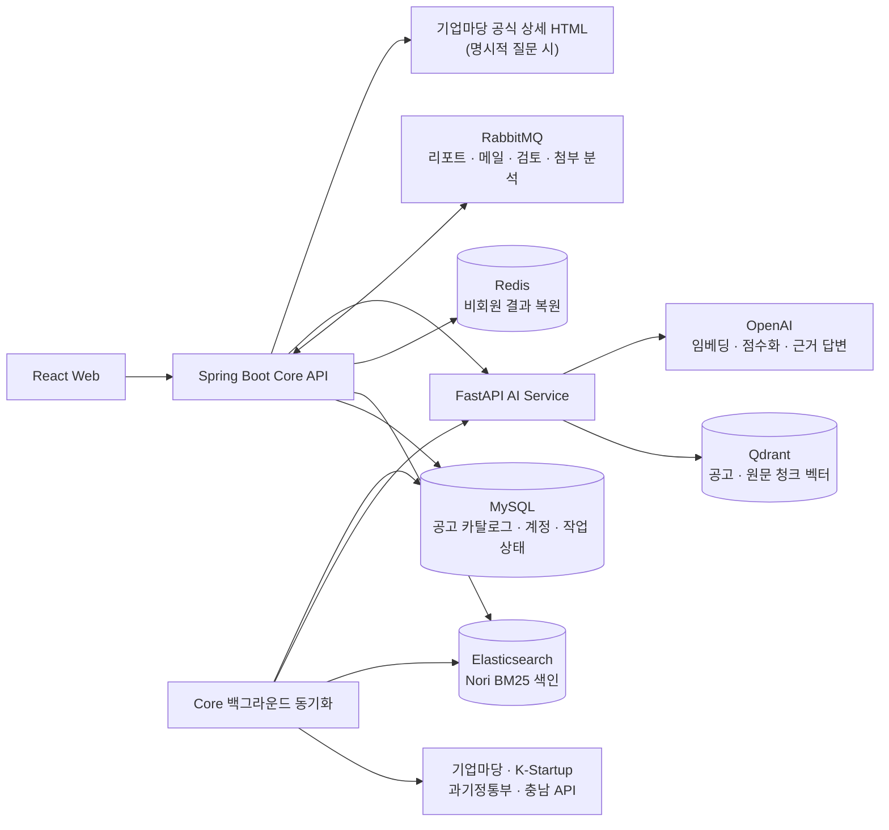
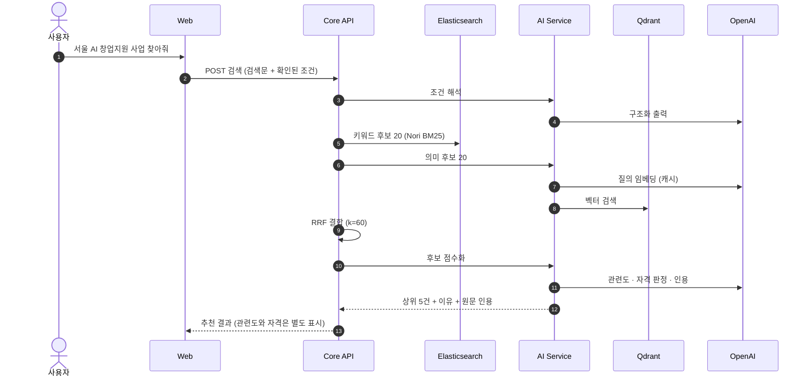
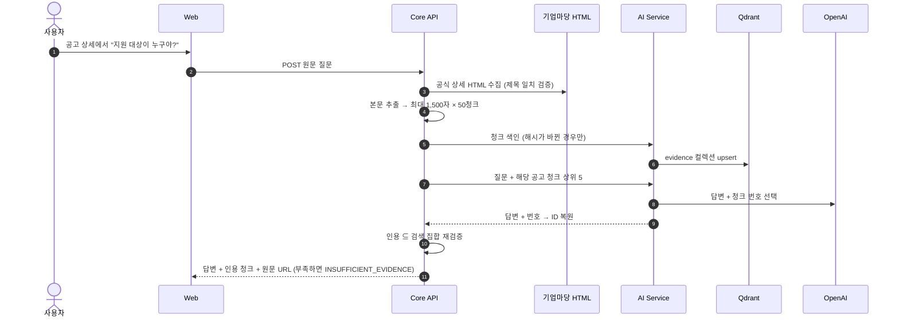
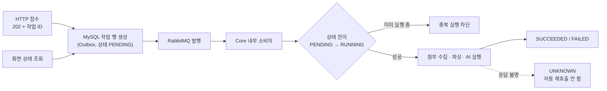

# 기능 흐름도 · 아키텍처 구조도

[메인 README](../README.md) · [서비스 단계](service-stage.md) · [주요 프로시저](procedures.md) · [ERD](erd.md)

## 1. 시스템 구성도

  

| 구성 요소 | 책임 | 하지 않는 것 |
|---|---|---|
| React Web | 화면, 대화 상태, 로그인 여부에 따른 라우팅 | 외부 API·AI Service 직접 호출 |
| Core API | 공개 HTTP 계약, 공고 수집·정규화·색인 동기화, 후보 결합(RRF), 인용 재검증, 계정·기업·큐 소비자 | 모델 호출 |
| AI Service | 임베딩, Qdrant 검색, 조건 해석·후보 점수화·근거 답변·문항 발견 Agent | 브라우저 공개, DB 직접 접근 |
| MySQL | 원본 데이터, 작업 상태(Outbox), AI 실행 스냅샷 | — |
| Elasticsearch · Qdrant | 재생성 가능한 파생 색인 | 원본 역할 |
| Redis | 비회원 검색 결과 30분 보관 | AI 캐시, 세션 저장 |
| RabbitMQ | 백그라운드 작업 전달 | 상태의 진실 원천(MySQL이 담당) |

## 2. 기능 흐름도 — AI 대화 검색 1회

## 3. 기능 흐름도 — 원문 근거 질문

## 4. 기능 흐름도 — 백그라운드 작업 (리포트 · 중복 검토 · 첨부 분석)

## 5. 계층 구조

| 서비스 | 계층 | 규칙 |
|---|---|---|
| Frontend | `presentation`(View · ViewModel) → `domain`(UseCase · Entity) → `data`(Repository · HTTP) | 의존 방향은 안쪽으로만, Awilix DI, 상태는 Redux Toolkit |
| Core API | `controller` → `facade` → `service` → `repository`(MyBatis XML) | 외부 통신은 `client`, 기능별 패키지, Flyway migration은 수정 금지·추가만 |
| AI Service | `router` → `service` → `agent`(구체 클래스) → OpenAI | typed Agent + `Runner.run(max_turns=1)`, 출력 계약 위반은 거부 |

상세: [아키텍처 README](architecture/README.md) · [호출·데이터 흐름](architecture.md) · [이미지 원본](assets/architecture/README.md)
