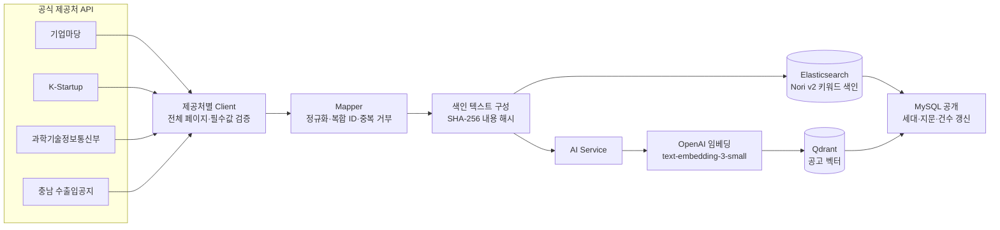

# 수집 데이터와 전처리

[메인 README](../README.md) · [문서 목록](README.md) · [호출·데이터 흐름](architecture.md) · [기술 구성](technology.md)

기준일: 2026-09-14. 어떤 공고 데이터를 어디서 받아, 어떻게 정리해 저장·색인하는지 한 문서에 모았습니다.
수치는 저장소에 기록된 실측값이며 현재 건수를 고정하는 설정이 아닙니다. 코드 위치와 계약은 각 상세 문서에 있습니다.

## 1. 데이터 흐름 한눈에

공고 수집은 사용자 요청과 분리된 백그라운드 작업입니다. 서비스 요청 시에는 이미 공개된 MySQL 카탈로그와
준비된 색인만 읽습니다. 청킹·임베딩·색인은 동기화 때 한 번 수행하고, 내용 해시가 같은 공고는 다시 임베딩하지 않습니다.



두 색인이 모두 준비된 뒤에만 MySQL에 공개합니다. MySQL이 원본이고 Elasticsearch·Qdrant는 재생성 가능한 파생 색인입니다.
색인 준비·복구·버전 경계는 [Elasticsearch 적용 상세](elasticsearch-lexical-search.md)와
[키워드·벡터 색인 정합성과 복구](architecture.md#키워드벡터-색인-정합성과-복구)를 참고하세요.

## 2. 데이터 출처

| 제공처 | 코드 | 수집 방식 | 인증 키 | 수집 범위·주기 | 2026-09-09 실수집 | 원문 질문 | 신청 첨부 분석 |
|---|---|---|---|---|---:|---|---|
| 기업마당 | `BIZINFO` | 공공데이터포털 API 전체 페이지·전체 건수·필수값 검증 | `DATA_GO_KR_SERVICE_KEY` | 전체, 정기 동기화 | 1,596 | 지원 (공식 상세 HTML) | 지원 |
| K-Startup | `KSTARTUP` | `getAnnouncementInformation01`, 안정 ID `pbanc_sn` | `KSTARTUP_API_KEY` | 기본 최근 1년(`RECENT_YEAR`), 3개월 옵션. 기본 OFF | 4,143 | 미지원 (공식 URL 표시) | 지원 |
| 과학기술정보통신부 | `MSIT` | `apis.data.go.kr` 전체 페이지 검증 (실측 10건/페이지) | `MSIT_API_KEY` (생략 시 공공데이터포털 키, 승인은 별도) | 6시간 주기. 기본 OFF | 4,249 | 미지원 | 지원 |
| 충청남도 수출입공지 | `CNTRADE_NOTICE` | API 제목·본문 + 공식 게시판 상세가 일치할 때만 첨부 채택 | `CNTRADE_NOTICE_API_KEY` | 6시간 주기. 기본 OFF | 기록 없음 | 미지원 | 지원 (조건부) |

- 2026-09-09 실수집 합계는 9,988건이며 그중 기본 `status=OPEN`은 1,781건입니다. 과기정통부 4,249건은 접수 기간을
  제공하지 않아 `UNKNOWN`으로 남고 기본 필터에서는 보이지 않습니다. [실수집·임베딩 검증](support-program-catalog.md#2026-09-09-실수집임베딩-검증)
- K-Startup은 API 날짜 조건(`cond[pbanc_rcpt_bgng_dt::GTE]`)이 실제 응답의 하한이 아니었습니다. 4,143건 중 325건은 조건보다
  먼저 시작했지만 모두 종료일이 기준일 이후여서 그대로 보존합니다. [K-Startup 수집 범위](architecture.md#k-startup-수집-범위와-추가-분류)
- 보조 외부 데이터: 기업 등록 시 Bizno 사업자등록번호 조회(등록 여부·상호·사업자 상태)는 공고 데이터가 아니며 검색에 쓰지 않습니다.

## 3. 저장 구조

| 테이블 | 저장 내용 | 갱신 시점 |
|---|---|---|
| `support_program` | 공고 제목·요약·기관·지원 대상·분류(JSON)·지역(JSON)·신청 기간(원문 + nullable 날짜)·출처 URL·노출 상태. 고유키 `(source_code, source_program_id)` | 제공처별 동기화 UPSERT. 원본에서 사라진 공고는 삭제하지 않고 `is_source_present=false` |
| `support_program_sync_status` | 제공처별 공개 세대·카탈로그 지문·공고 수·색인 준비 상태 | 색인 성공 후 공개 시 |
| `support_program_source_document` | 공고별 공식 원문 정규화 텍스트·원문 URL·SHA-256·수집 시각 | 정기 동기화가 아니라 **사용자의 명시적 원문 질문**이 성공했을 때만 UPSERT |
| `application_form_snapshot` | 공식 첨부(PDF/HWP/HWPX)에서 발견한 양식 manifest JSON·파일 hash·파서/모델/프롬프트 버전 | 신청 문서 준비에서 첨부 분석 완료 시, 공고별 불변 버전 |
| Qdrant 공고 컬렉션 | 공고 1건 = 벡터 1개. payload에 복합 ID·내용 해시·제공처 | 동기화 시 내용 해시가 바뀐 공고만 |
| Qdrant evidence 컬렉션 | 원문 청크 벡터. payload에 청크 ID·내용 해시·문서 ID·순서 | 원문 질문 시 문서 해시가 바뀐 경우만 |
| Elasticsearch `support-program-lexical-v2` | `id`·`contentHash`·`sortTimestamp`·`text` | 동기화 시 새 버전 색인 후 전환 |

계정·기업·관심 공고·리포트 등 사용자 데이터 테이블은 [계정·인증 계약](account-auth-contract.md)과 각 기능 문서에 있습니다.

## 4. 정규화·전처리 규칙

| 대상 | 규칙 | 이유 |
|---|---|---|
| 식별자 | `sourceCode:sourceProgramId` 복합 ID. 같은 응답 안의 중복 ID는 오류로 거부하고, 대소문자만 바뀐 ID는 최신 표기로 갱신 | MySQL·Elasticsearch·Qdrant 식별자를 하나로 맞춤 |
| 제목·본문 | 앞뒤 공백 제거, 연속 공백은 한 칸으로. `\n`·`\r`·`\t`를 제외한 제어 문자(`\p{C}`) 제거 | 색인 텍스트와 해시의 안정성 |
| 요약 | 공식 API 사업개요 본문, 최대 6,000 Unicode code point | 후보 점수화 입력 상한 |
| 분류 | `,` `/` `·` `>` 구분자로 나누고 각각 공백 정리 | 제공처마다 구분자가 다름 |
| 지역 | 정식 명칭 → 약칭 별칭표 17개 시·도 + `전국` (예: `서울특별시 → 서울`, `강원특별자치도 → 강원`). K-Startup `전남광주`는 `전남`·`광주`로 분리, `전국`이 있으면 `전국`만 유지 | 필터·자격 판정에 같은 지역 어휘 사용 |
| 신청 기간 | 원문 문자열을 보존하고 파싱 가능한 시작·종료 날짜만 별도 저장 | 원문 표현을 잃지 않으면서 상태 계산 |
| 접수 상태 | 읽을 때 계산. 시작 전 `UPCOMING`, 범위 안 `OPEN`, 종료 후 `CLOSED`(경계 포함). 날짜가 없으면 예정·종료·상시 접수 표현 규칙을 순서대로 적용하고 근거가 없으면 `UNKNOWN` 유지 | 파싱된 날짜를 표현 규칙이 덮어쓰지 않도록 |
| 사라진 공고 | 삭제하지 않고 `is_source_present=false` | 저장된 관심 공고·신청 준비의 참조 유지 |
| K-Startup 추가 분류 | 창업 업력·대상·대표자 연령 분류는 **검색용 메타데이터**로만 색인 텍스트에 넣고 신청 자격 근거로 쓰지 않음 | 태그와 실제 자격 요건을 구분 |
| 지역 태그 vs 자격 | 지역 태그는 필터용이며 자격 판정은 원문 인용으로만 | [원문 우선 자격 판정](source-first-eligibility-review.md) |

## 5. 색인 텍스트와 임베딩

의미 검색과 키워드 검색이 **같은 텍스트와 같은 내용 해시**를 쓰도록 Core가 한 번 구성합니다
([`SupportProgramIndexTextHelper`](../backend/core-api/src/main/kotlin/ai/govbiz/core/supportprogram/helper/SupportProgramIndexTextHelper.kt)).

```text
제목: {title}
기관: {organization}
지원대상: {targetDescription}
분야: {categories, 쉼표 구분}
지역: {regions, 쉼표 구분}
신청기간: {applicationPeriod}
내용: {summary}
검색용 분류 메타데이터 (신청 자격 근거 아님)   ← K-Startup만
창업 업력 분류: … / 대상 분류: … / 대표자 연령 분류: …
```

| 항목 | 값 |
|---|---|
| 청킹 | 공고 검색 텍스트는 **청크로 나누지 않음** (공고 1건 = 벡터 1개). 텍스트 상한 12,000 code point |
| 임베딩 모델 | `text-embedding-3-small` 1,536차원 (`text-embedding-3-large` 3,072차원 선택 가능) |
| 재사용 | SHA-256 내용 해시가 같으면 재임베딩하지 않음. 2026-09-09 검증에서 9,988건 벡터 누락·payload 불일치 0건 |
| 규모 경계 | 검색·색인 문서 수 상한 20,000건. 그 이상은 검증 범위 밖 |
| 키워드 색인 | 분석기 `korean`(색인)·`korean_search`(검색). `nori_tokenizer decompound_mode=discard`, 사용자 사전 규칙 6건, 검색 시점 `synonym_graph` 1건. 정의 파일 [v1](../backend/core-api/src/main/resources/elasticsearch/support-program-lexical-v1.json) · [v2](../backend/core-api/src/main/resources/elasticsearch/support-program-lexical-v2.json)는 불변 버전 |
| 후보 결합 | 키워드 BM25 후보 최대 20 + 의미 후보 최대 20 → RRF(k=60) → LLM 점수화 |

공고 단위로 벡터 하나만 두는 이유: 공고는 요약 길이가 짧고 목적이 "공고 목록 추천"이라 문단 검색이 필요하지 않습니다.
문단 단위 근거가 필요한 원문 질문은 아래 6절의 별도 컬렉션을 씁니다.

## 6. 원문 근거 문서 (RAG용)

기업마당 공고에 한해, 사용자가 **명시적으로 질문했을 때만** 공식 상세 HTML을 수집합니다. 정기 동기화에서 원문을 긁어 두지 않습니다.

| 단계 | 규칙 |
|---|---|
| 수집 | 공식 HTTPS 상세 페이지. 리다이렉트·공고 식별자 검증, 페이지 제목이 저장된 공고 제목과 정규화 후 일치해야 채택 |
| 본문 추출 | jsoup으로 `.support_project_detail` 안의 `.view_cont`만 선택. `script`·`style`·`nav`·`footer`·`iframe`·폼 요소·숨김 요소 제거, 블록 요소 경계를 줄바꿈으로 보존 |
| 정규화 텍스트 | `공고명: … / 공식 원문: {URL}` 머리말 + 본문. 제어 문자 제거. SHA-256 해시와 함께 저장 |
| 청킹 | 줄 단위로 나눠 빈 줄 제거 → 긴 구간 분할 → 최대 **1,500 UTF-16 코드 단위**로 순서대로 채움. 최대 **50청크**, 겹침 없음. 청크 ID = SHA-256(문서 ID + 문서 해시 + 순서)이라 같은 원문은 항상 같은 ID |
| 색인 | Qdrant evidence 컬렉션. 문서 해시가 바뀐 경우만 재색인 |
| 검색·인용 | 질문당 해당 공고 청크 최대 5개 검색 → 모델은 청크 **번호**만 선택 → Core가 ID 복원, 인용 ⊆ 검색 집합 재검증. 근거가 부족하면 `INSUFFICIENT_EVIDENCE` |

공식 첨부(PDF/HWP/HWPX)는 신청 문서 준비에서만 위치 정보 포함 블록으로 파싱하며 임베딩하지 않습니다.
암호화 문서·스캔 PDF·임의 업로드는 지원하지 않습니다. [신청 문서 설계](application-preparation-design.md)

## 7. 평가용 고정 데이터

| 자료 | 내용 | 위치 |
|---|---|---|
| 공고 스냅샷 | 2026-09-06 기준 접수 중 기업마당 공고 1,422건 | [실데이터 평가](../evaluation/support-program-search/runs/support-program-catalog-20260906-v1/README.md) |
| 키워드 검색 질문 | 300개 + 추가 16개. 목표 공고·라벨 고정 | [Nori v2 비교](../evaluation/support-program-search/runs/lexical-v2-20260913-v1/README.md) |
| AI 검색 판정 | 질문 16개 × 공고 570조합, AI-only 판정 541건 합의·29건 미확정 | 위 실데이터 평가 |
| 근거 답변 | 가상 공고·고정 청크·질문, 공식 HTML 6건 전체 경로 기록 | [RAG 검수·답변 평가](../evaluation/support-program-evidence/README.md) |
| 도우미 의도 분류 | 가상 질문 50개 (dev/heldout) | [도우미 평가](../evaluation/assistant/README.md) |

질문과 판정은 모두 AI가 작성했으며 사람 검증 정답이나 실제 사용자 질문이 아닙니다. 지표는 재현성을 뜻하며 실제 검색 정확도를 보증하지 않습니다.

## 8. 이용 조건과 개인정보

- 공고 데이터는 공공 API 응답이며 개인정보를 포함하지 않습니다. 계정·기업 정보는 별도 테이블에 저장하고 검색 색인에 넣지 않습니다.
- 공공데이터포털 각 API의 이용허락 범위(원문 재배포 가능 여부 포함)는 **아직 확인하지 않았습니다**. 평가용 스냅샷을 공개 저장소에
  두는 것이 허용되는지 제출 전에 확인해야 합니다.
- OpenAI 호출은 `store=false`로 요청하며 검색어·원문을 모델 제공자에 보관하지 않도록 설정합니다. 이는 요청 옵션이며 제공자 정책은 별도입니다.
- 원문 HTML은 명시적 질문 시에만 저장하고, 공고가 비공개(`is_source_present=false`)이면 원문 질문을 제공하지 않습니다.

## 9. 한계

- 과기정통부 공고는 접수 기간이 없어 상태를 판정할 수 없고, 충남 수출입공지는 실수집 건수를 기록하지 않았습니다.
- 원문 질문과 근거 인용은 기업마당 HTML 한 종류에만 구현되어 있습니다. 첨부파일·OCR 기반 RAG는 범위 밖입니다.
- 청킹은 줄 단위 결정적 분할이며 문단 의미 경계·겹침을 고려하지 않습니다. 공고당 청크가 1개인 사례가 많아 다중 청크 검색 품질은 미평가입니다.
- 오래된 색인 버전의 저장 공간 정리는 자동화하지 않았습니다.
