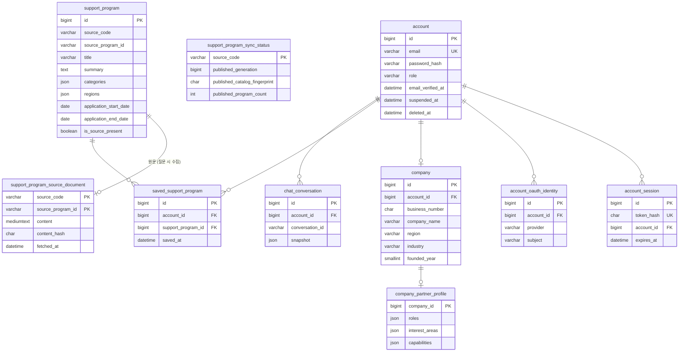
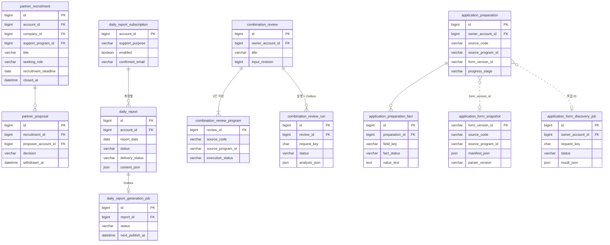

# ERD

[메인 README](../README.md) · [주요 프로시저](procedures.md) · [수집 데이터와 전처리](data-collection-and-preprocessing.md)

기준: Flyway migration V1~V33 (2026-09-14, `main`). MySQL이 원본이며 Elasticsearch·Qdrant는 파생 색인, Redis는 임시 보관입니다.
그림은 핵심 열만 표시하고, 관계는 migration의 FK와 참조 열 기준입니다. 공고를 참조하는 일부 테이블은 FK 없이
복합 ID(`source_code`, `source_program_id`)로 연결되며 점선으로 표시했습니다.

## 1. 공고 · 계정 · 기업

`account_password_reset`, `signup_email_verification`, `account_admin_action`, `account_oauth_unlink_job`은 계정 보조 테이블입니다(토큰·인증번호 해시, 관리자 조치 기록, 탈퇴 연결 해제 작업).

## 2. 파트너 · 리포트 · 검토 · 신청 문서

`combination_review_run_source`(첨부 원본 바이트)와 `application_preparation_interpretation_run`(AI 해석 실행 스냅샷)은 각 실행의 하위 테이블입니다.
`daily_report_generation_budget`은 날짜별 생성 시도 예산입니다.

## 3. MySQL 밖의 저장 구조

| 저장소 | 단위 | 키 · 내용 | 수명 |
|---|---|---|---|
| Elasticsearch `support-program-lexical-v2` | 공고 1건 = 문서 1개 | `id`(복합 ID) · `contentHash` · `sortTimestamp` · `text`(Nori 분석) | 동기화마다 새 버전 색인 후 전환, MySQL 지문과 대조 |
| Qdrant 공고 컬렉션 | 공고 1건 = 벡터 1개(1,536차원) | UUID = f(복합 ID, 내용 해시), payload에 ID·해시·제공처 | 해시가 바뀐 공고만 갱신 |
| Qdrant evidence 컬렉션 | 원문 청크 1개 = 벡터 1개 | 청크 ID = SHA-256(문서 ID + 문서 해시 + 순서), payload에 문서 ID·순서 | 원문 해시가 바뀔 때 재색인 |
| Redis | 비회원 검색 1회 | 검색 결과·조건·소유 계정 | 30분 TTL, 로그인 후 복원 시 삭제 |
| RabbitMQ quorum queue | 작업 1건 | 리포트 생성 · 메일 발송 · 중복 검토 · 첨부 분석 · 카카오 연결 해제 | 상태·재시도는 MySQL 작업 행(Outbox)이 기준 |

## 4. 설계 원칙

- **원본은 하나**: 공고는 `(source_code, source_program_id)` 고유키로 식별하고 색인 식별자도 같은 값을 씁니다.
- **삭제하지 않는다**: 원본에서 사라진 공고는 `is_source_present=false`, 탈퇴 계정은 `deleted_at`, 리포트·검토는 상태 열로 표현합니다.
- **실행 행이 Outbox**: 백그라운드 작업은 HTTP 접수 시 MySQL 행을 먼저 만들고 큐에 전달합니다. 상태 전이로 중복 실행을 막습니다.
- **AI 실행은 스냅샷으로 보존**: 입력·출력·모델·프롬프트 버전을 JSON으로 저장해 나중에 재현·검수할 수 있습니다.
