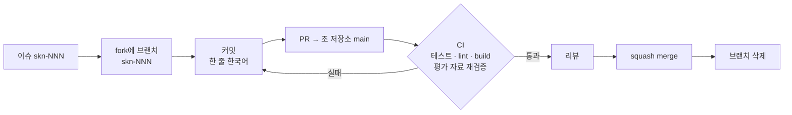

# GitHub Flow 사용 여부

[메인 README](../README.md) · [트러블슈팅](troubleshooting.md) · [테스트 계획과 결과](test-plan-and-results.md)

**사용했습니다.** 조 저장소(`SKNETWORKS-FAMILY-AICAMP/SKN34-3rd-1Team`)의 `main` 하나를 기준으로, 각자 fork에서
이슈 단위 브랜치를 만들어 PR로 합쳤습니다. 2026-09-02 ~ 09-14 동안 PR #308까지 열렸고 커밋 342개가 `main`에 있습니다.

## 규칙

| 항목 | 규칙 |
|---|---|
| 브랜치 | `skn-NNN`(이슈 번호). `main`에서 시작하고 병합 뒤 삭제 |
| 커밋 | 한 줄 한국어로 무엇을 바꿨는지. 작업 도구 서명은 넣지 않음 |
| PR | 이슈 하나 = PR 하나. 본문에 변경 범위·검증 결과(테스트 건수)·남은 범위 |
| 병합 | squash merge. 병합 전 로컬 전체 테스트(Frontend `pnpm test`, Core `./gradlew clean build`, AI `pytest`) |
| CI | GitHub Actions 3 job(Frontend · Core API · AI Service) + 평가 도구·공유 평가 자료 재계산. 모델 호출 없음 |
| DB | Flyway migration은 추가만, 적용된 파일 수정 금지. 번호는 **병합 직전 main 기준**으로 배정 |
| 문서 | 기능마다 `docs/`에 계약·검증 기록, 실험 수치는 `evaluation/` 실행 폴더 |
| 의존성 | production 의존성 추가 전 팀에 알림, 실패를 숨기는 fallback 금지 |

## 기여 현황 (2026-09-14, `main`)

| 팀원 | 커밋 | PR(병합) | 주요 영역 |
|---|--:|--:|---|
| 김건우 (@ilil1) | 202 | 62 | 검색·RAG, Elasticsearch·RabbitMQ·Redis, 평가, 인프라·배포 |
| 김동섭 (@kimdongseop, PR 계정 20220348-kim) | 65 | 25 | 신청 문서 준비, 중복 지원·수혜 검토 |
| 이성민 (@lsm15111) | 56 | 28 | 계정·소셜 로그인·관리자, 관심 공고함, 파트너·프로필, 도우미 |
| Genus-Jae | 19 | 1 | 관심 공고 달력·진행 관리 |
| 조 저장소 직접 병합 | — | 34 | 초기 구성·문서 |

<!-- TODO(팀): Genus-Jae 계정의 이름과 나머지 팀원 정보를 채워 주세요. -->

## 겪은 문제와 해결

| 문제 | 해결 |
|---|---|
| 병렬 브랜치가 같은 Flyway 번호를 추가해 병합 시 충돌 (skn-140) | 병합 직전 main의 마지막 번호로 재배정. 적용된 migration은 수정하지 않음 |
| 프런트 전체 테스트 병렬 실행 시 1건 시간 초과 | `pnpm test --maxWorkers=2`로 실행 |
| 오래된 브랜치 누적 | 병합된 브랜치는 로컬·origin에서 삭제(2026-09-14 정리 시 로컬 38개·origin 20개) |
| 백엔드 변경 후 화면·API 버전 불일치 | 갱신 절차 문서화(설정·대기 작업 확인 → 컨테이너 재빌드 → 검색 준비 상태 확인) |
