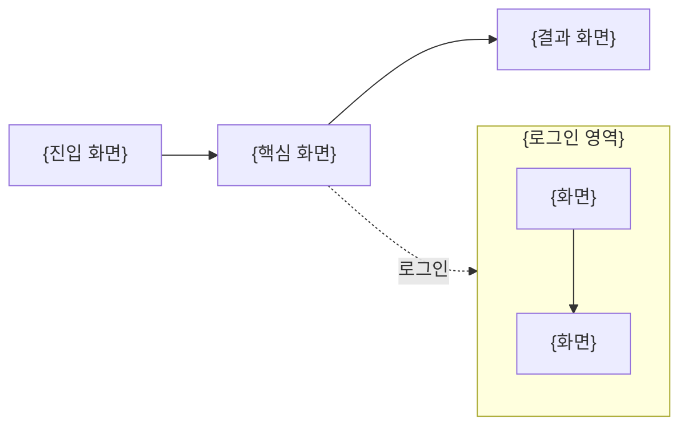
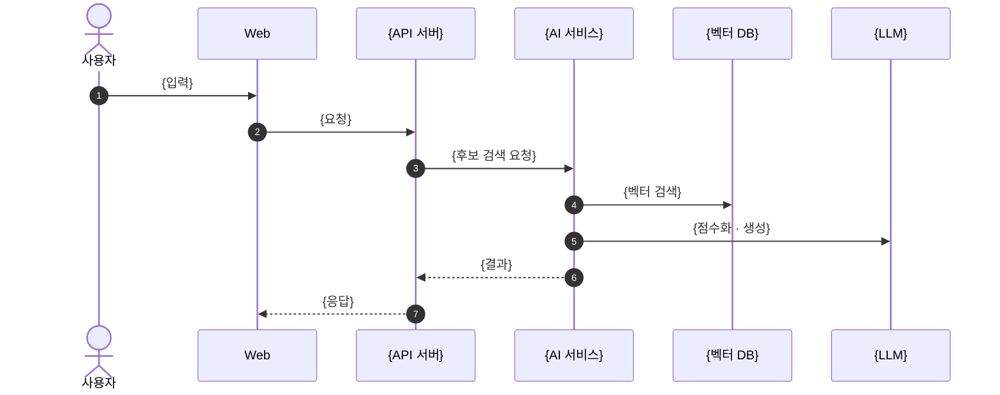
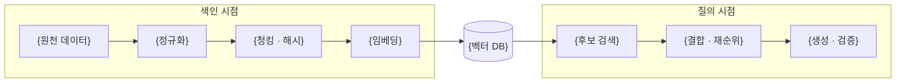

# README 기본 틀

[메인 README](../README.md) · [문서 목록](README.md)

메인 README를 쓰거나 고칠 때 쓰는 틀입니다. 아래 순서와 그림 자리를 유지하고 `{…}`만 채웁니다.
글보다 **구조도·흐름도**를 앞세우고, 표·수치·상세 설명은 `docs/`에 두고 링크만 겁니다.
`<!-- -->` 주석은 작성 요령이며 복사한 뒤 지웁니다.

---

````markdown
<div align="center">

# {프로젝트명}

**{한 줄 정의: 누가 · 무엇을 · 어떻게}**

<!-- 배지는 CI + 핵심 기술 6개 안쪽. style=flat-square -->
[](https://github.com/{org}/{repo}/actions/workflows/ci.yml)


{캠프·기수} · {차수} 프로젝트({주제}) · {팀} · {시작일} ~ {종료일}

[기능 구조](#기능-구조) · [화면 흐름](#화면-흐름) · [시스템 아키텍처](#시스템-아키텍처) · [RAG 파이프라인](#rag-파이프라인) · [빠른 시작](#빠른-시작) · [문서](#문서)

</div>

<!-- 소개는 3문장 안쪽: 어떤 데이터를 · 어떻게 처리해 · 무엇을 준다 -->
{소개}

<!-- 핵심 숫자 4~5칸. 출처가 있는 실측값만 -->
| {지표 1} | {지표 2} | {지표 3} | {지표 4} |
|:---:|:---:|:---:|:---:|
| **{값}** | **{값}** | **{값}** | **{값}** |

## 팀

| 이름 | GitHub | 담당 |
|---|---|---|
| {이름} | [@{id}](https://github.com/{id}) | {맡은 기능 · 영역} |

<!-- 협업 규칙 한 줄: 브랜치 → PR → 병합 방식, 병합 조건 -->
{협업 한 줄}

## 기능 구조

<!-- 기능을 3~4 묶음으로. 미지원 범위는 그림 아래 한 줄 -->
```mermaid
mindmap
  root(({프로젝트명}))
    {묶음 1}
      {기능}
      {기능}
    {묶음 2}
      {기능}
    {묶음 3}
      {기능}
```

{미지원 범위 한 줄}

## 화면 흐름

<!-- 진입 화면 → 핵심 화면 → 로그인 뒤 화면. 스크린샷은 docs/assets/screens/ 에 두고 그림 아래에 4장 -->


## 시스템 아키텍처

<!-- 구성도 이미지 1장 (docs/assets/architecture/). 경계 규칙은 3줄 안쪽 -->
<p align="center">
  
</p>

- {진입점과 키 보관 위치}
- {원본 저장소와 파생 색인의 관계}
- {큐·캐시의 용도 한정}

<!-- 대표 요청 1건의 호출 순서. 참여자 7개 안쪽, 메시지 15줄 안쪽 -->


{상세 문서 링크 한 줄}

## RAG 파이프라인

<!-- 색인 시점(동기화 때 1회)과 질의 시점(요청당)을 subgraph로 분리 -->


<!-- 경로가 둘 이상이면 표 1개: 문서 단위 · 청킹 · 검색 · 생성·검증 -->
| 경로 | 문서 단위 | 청킹 | 검색 | 생성·검증 |
|---|---|---|---|---|
| {경로} | {단위} | {크기 × 개수, 겹침} | {top-k, 결합} | {검증 규칙} |

{모델·프롬프트 방식 한 줄}

## 데이터

<!-- 출처별 1행. 건수는 날짜와 함께. 상세는 docs/data-collection-and-preprocessing.md -->
| 출처 | {날짜} 수집 | {지원 범위} |
|---|---:|:---:|
| {출처} | {건수} | {○/✕} |

{데이터 문서 링크}

## 검색 품질과 속도

<!-- 차트 1~2장 (docs/assets/readme/*.svg). 측정 조건과 한계를 한 줄로. 원표는 evaluation/ -->
<p align="center"></p>

{측정 조건 · 한계 한 줄} · [테스트 계획과 결과](docs/test-plan-and-results.md)

## 빠른 시작

<!-- 명령 2~3개. 필요한 키·비용·첫 실행 대기 안내 -->
```bash
{설치 명령}
```

```bash
{실행 명령}
```

{접속 주소} · {주의 한 줄} · [실행 안내]({링크})

<details>
<summary>프로젝트 구조</summary>

```text
.
├── {폴더}/   {역할}
└── {폴더}/   {역할}
```

</details>

## 검증

<!-- 서비스별 테스트 건수 한 줄 + 테스트 보고서·트러블슈팅 링크 -->
{테스트 건수 한 줄}. [테스트 계획과 결과](docs/test-plan-and-results.md) · [트러블슈팅](docs/troubleshooting.md)

## 다음 단계

1. **{작업}** — {한 줄}
2. **{작업}** — {한 줄}

## 회고

| 이름 | 한 줄 회고 |
|---|---|
| {이름} | {회고} |

## 문서

| 과제 산출물 | 문서 |
|---|---|
| 수집 데이터 및 전처리 | [{문서}]({링크}) |
| 시스템 아키텍처 | [{문서}]({링크}) |
| RAG · 벡터 DB 연동 코드 | [{문서}]({링크}) |
| 테스트 계획 및 결과 보고서 | [{문서}]({링크}) |

{기술 스택 · 전체 문서 목록 링크}
````

---

## 작성 규칙

| 항목 | 규칙 |
|---|---|
| 길이 | 200줄 안쪽. 넘치면 `docs/`로 옮기고 링크 |
| 그림 | mermaid는 flowchart · sequenceDiagram · mindmap만. 한글 라벨은 `["…"]`로 감싸고 괄호·`<br/>`는 따옴표 안에서만 |
| 이미지 | PNG/SVG는 `docs/assets/` 아래 상대 경로. SVG 안의 스크립트·외부 폰트는 GitHub에서 무시됨 |
| 수치 | 날짜·조건·출처가 있는 실측값만. "예정"·"추정"은 그렇게 표기 |
| 앵커 | 한글 제목 링크는 `#한글-제목` (소문자, 공백 → `-`, 구두점 제거) |
| 표 | 한 절에 표 1개. 행이 8개를 넘으면 `docs/`로 |
| 확인 | PR 화면에서 mermaid·이미지 렌더 확인 후 병합 |
