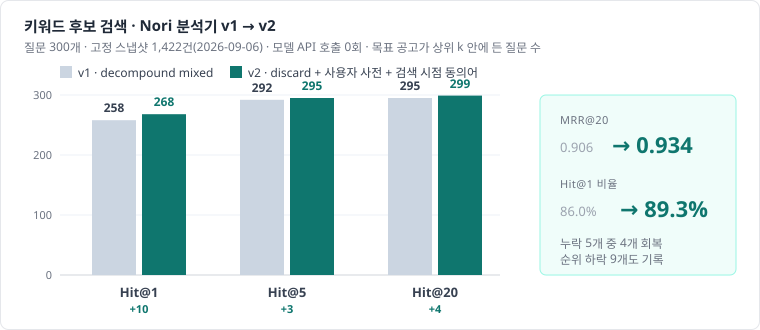
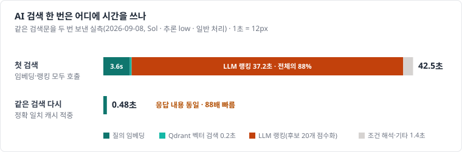

# 검색 성능 개선

[메인 README](../README.md) · [서비스 단계](service-stage.md) · [테스트 계획과 결과](test-plan-and-results.md) · [트러블슈팅](troubleshooting.md)

"느리면 인덱싱과 런타임부터 확인" 원칙에 따라 **검색 / 리랭크 / LLM 생성 시간을 각각 측정**한 뒤 개선했습니다.
수치는 저장소의 평가 실행 폴더(`evaluation/`)에 원표가 있습니다.

## 1. top-k

| 위치 | k | 근거 |
|---|---|---|
| 키워드 후보 | 20 | 15로 줄이면 Q044(제주 음식점 시설 개선 융자, v2에서 16위)를 놓침. 300개 질문 기준 Hit@20 299/300 |
| 의미 후보 | 20 | 키워드 후보와 같은 수로 RRF 결합 |
| LLM 점수화 입력 | 최대 20 | 후보 본문(요약 최대 6,000자)이 입력 토큰의 대부분. 20개 점수화가 약 37초 |
| 최종 추천 | 5 | `semanticRelevance >= 20` 통과 후 관련도 총점 상위 5 |
| 원문 근거 청크 | 5 | 공고당 청크가 1~수 개라 5면 충분. 더 늘려도 답변 품질이 오르지 않음 |

## 2. Hybrid Search

벡터 검색만으로는 지역명·기관명·사업명 정확 일치를 놓치고, 키워드만으로는 표현이 다른 공고를 놓칩니다.

```text
Nori BM25 (Sparse) 상위 20  ┐
                            ├─ RRF (k=60) → 후보 ≤ 20 → LLM 점수화
Qdrant 벡터 (Dense) 상위 20 ┘
```

한국어 분석기 설정을 v1 → v2로 바꾸고 같은 고정 스냅샷(2026-09-06, 공고 1,422건)·질문 300개로 비교했습니다. 모델 API 호출 0회.

<p align="center">
  
</p>

| 300개 질문 | v1 | v2 |
|---|---:|---:|
| Hit@1 | 258 | **268** |
| Hit@5 | 292 | 295 |
| Hit@20 | 295 | **299** |
| MRR@20 | 0.9061 | **0.9338** |

- v2 변경: `nori_tokenizer decompound_mode=discard`, 사용자 사전 규칙, 검색 시점 `synonym_graph`. 색인 정의는 불변 버전 파일로 두고 v1은 보존.
- 누락 5개 중 4개 회복(예: `횡성 소상공인 대출이자` 20위 밖 → 1위). 순위가 내려간 9개 질문도 보고서에 기록.
- 특정 질문만 맞추는 부정확한 동의어(`전문가=현장애로`)는 넣지 않음.

## 3. 런타임 최적화

| 문제 | 조치 | 효과 |
|---|---|---|
| 랭킹 25초 제한에 걸려 503 | 랭킹 전용 예산 모델 45초 / Agent 50초 / Core 55초 / Web 90초, 시간 초과는 504로 구분 | 같은 검색 완료, 화면 재시도 가능 |
| 모델이 64자리 인용 ID를 63자리로 복사 | 모델은 청크·후보 **번호**만 반환, 코드가 ID·인용문 복원 | 인용 검증 실패 재발 없음 |
| 서울 기업에 안산 관내 공고 추천 | 지역 판정 전제를 프롬프트·schema에 명시(서울/안산 = `INCOMPATIBLE`) | 추가 LLM 호출 없이 수정 |
| LLM 호출 횟수 | 검색 1회 = 조건 해석 1 + 임베딩 1 + 점수화 1. Query Rewrite·Multi Query·Map-Reduce 미사용 | 단순한 `Retrieve → Rerank → Generate` 유지 |
| 처리 등급 | OpenAI Fast 처리를 랭킹에만 적용 | 중앙값 41.1 → 27.2초(약 30%), 토큰 단가 2배 |

## 4. 캐싱

<p align="center">
  
</p>

| 캐시 | 키 | 크기 · 수명 | 효과 |
|---|---|---|---|
| 질의 임베딩 | 검색문 정확 일치 | 256개 · 5분 | 3.6초 절감 |
| 랭킹 결과 | 후보 공고 내용·기준일·조건·계약 버전 정확 일치 | 128개 · 5분 | 37.2초 → 0.001초 |
| 동시 요청 | 같은 키의 진행 중 계산 재사용 | — | 중복 호출 방지 |

- 같은 검색 두 번째 응답 **42.467초 → 0.484초**, 응답 내용 동일.
- 캐시 키에 카탈로그 내용을 포함하므로 공고가 바뀌면 오래된 결과를 돌려주지 않습니다. 의미 기반(유사 질문) 캐시는 쓰지 않습니다 — "서울 제조업"과 "부산 제조업"은 정답이 다릅니다.
- 한계: 캐시는 AI Service 프로세스 메모리에만 있어 재시작·다중 인스턴스에서 공유되지 않습니다. Redis 공유 캐시는 [향후 개선 계획](roadmap.md)에 있습니다.

## 5. 아직 하지 않은 것

- 리랭커 모델(별도 cross-encoder) 도입 — 현재는 LLM 점수화가 재순위 역할을 겸함.
- 전 구간 AI 검색의 대규모 평가 — 양성 질문 2개뿐이라 정확도 결론 불가.
- 스트리밍 응답 — 첫 토큰 체감 개선 여지.
