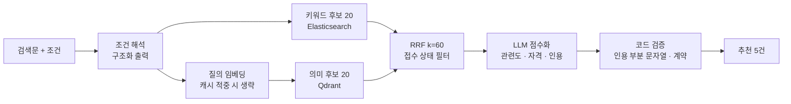

# 서비스 단계

[메인 README](../README.md) · [인덱싱 단계](../README.md#4-인덱싱-단계) · [검색 성능 개선](search-performance.md)

인덱싱(동기화 때 1회)과 분리된 **서비스 시점**의 동작입니다. 요청마다 문서 로딩·청킹·임베딩·벡터 저장을 다시 하지 않고,
검색(Retrieve) + 결합·재순위 + 생성(Generate)만 수행합니다.

## 1. 서비스 시작 시 준비

| 서비스 | 시작 시 한 번 | 확인 |
|---|---|---|
| Core API | MySQL 연결·Flyway, Elasticsearch·Redis·RabbitMQ 클라이언트, 제공처별 색인 준비 상태 읽기 | 준비 상태 API가 `SEARCHABLE`이면 검색 가능. 준비 안 된 제공처는 검색 범위에서 제외 |
| AI Service | OpenAI 클라이언트, Qdrant 클라이언트, 컬렉션 존재 확인, 임베딩·랭킹 캐시 초기화 | `/health` |
| Web | 환경값(API 주소, 도우미 AI 스위치) | — |

Elasticsearch가 없으면 검색은 명시적 503, 목록·상세 조회는 MySQL로 유지됩니다. Redis·RabbitMQ 장애는 복원·백그라운드 작업만 멈춥니다.

## 2. 요청당 파이프라인 — AI 대화 검색

| 단계 | 입력 → 출력 | 시간 예산 | 캐시 |
|---|---|---|---|
| 조건 해석 | 검색문·이전 조건 → 확정 조건 또는 변경 제안 | 모델 25초 / Agent 30초 | 없음 |
| 키워드 후보 | 검색문 + 조건 → 상위 20 | Core 읽기 30초 | 없음 (ES 자체 캐시) |
| 임베딩 | 검색문 → 1,536차원 | 의미 검색 Core 읽기 30초 | 정확 일치 256개 · 5분 |
| 의미 후보 | 벡터 → 상위 20 | (위와 같음) | — |
| 결합 | 두 목록 → RRF(k=60) 후보 최대 20 | — | — |
| 점수화 | 후보 20 + 조건 → 점수·자격·인용 | 모델 45초 / Agent 50초 / Core 55초 / Web 90초 | 정확 일치 128개 · 5분, 동시 같은 요청 재사용 |
| 검증 | 인용 ⊆ 후보 본문, 필수 필드, `semanticRelevance >= 20` | — | — |

## 3. 요청당 파이프라인 — 원문 근거 질문

`질문 → (원문 없거나 바뀌면 수집·청킹·색인) → 해당 공고 청크 상위 5 → 답변 + 청크 번호 → ID 복원 → 인용 재검증`.
Context는 최대 5청크로 제한하고, 근거가 부족하면 `INSUFFICIENT_EVIDENCE`로 답합니다. 문서 요약·Map-Reduce·Multi Query는 쓰지 않습니다.

## 4. 시간 측정

각 단계는 로그에 `support_program_search stage=… duration_ms`, 랭킹 `model_ms`, 도우미 `assistant_answer_run`으로 남깁니다.

| 실측 (2026-09-08, Sol · low · 일반 처리) | 첫 검색 | 같은 검색 다시 |
|---|--:|--:|
| 질의 임베딩 | 3.645초 | 캐시 |
| 벡터 검색 | 0.233초 | 0.144초 |
| LLM 랭킹 | 37.236초 | 0.001초 |
| 전체 | **42.467초** | **0.484초** |

병목은 벡터 DB가 아니라 LLM 랭킹(88%)입니다. 개선 내역은 [검색 성능 개선](search-performance.md).

## 5. 요청 제한과 오류 경계

| 경계 | 동작 |
|---|---|
| 요청량·동시 실행 초과 | 429 / 503, Retry-After |
| 랭킹 시간 초과 | 504로 구분, 화면 재시도 |
| 모델 출력 계약 위반 | 503, 조용한 대체 응답 없음 |
| 색인 미준비 제공처 | 검색 범위에서 제외, 준비 상태 API로 표시 |
| 후보 20,000건 초과 카탈로그 | 검증 범위 밖 |

## LangChain 개념과 코드 대응

과제 목표의 LangChain 대신 OpenAI SDK · Agents SDK · qdrant-client를 직접 사용했습니다.

| LangChain 개념 | GovBiz 구현 | 위치 |
|---|---|---|
| Document Loader · Text Splitter | 제공처별 API Client·Mapper, 원문 HTML 추출과 `SupportProgramEvidenceChunker` | `backend/core-api/.../supportprogram/client`, `service/evidence` |
| Embeddings · VectorStore | OpenAI 임베딩 + qdrant-client, 내용 해시 재사용 | `backend/ai-service/app/support_program_embedding.py`, `support_program_index` |
| Retriever (Hybrid) | Elasticsearch Nori BM25 + Qdrant → RRF | `backend/core-api/.../supportprogram/service/search` |
| PromptTemplate · Few-shot | 인라인 예시가 포함된 instructions 상수 | `backend/ai-service/app/*/prompt.py` |
| Chain · Output Parser | Agents SDK `Agent(output_type=…)` + `Runner.run(max_turns=1)`, Pydantic 검증과 인용 재검증 | `backend/ai-service/app/*/agent.py`, `service.py` |
| Memory | 계정별 대화 스냅샷(MySQL)과 요청에 실어 보내는 최근 이력 | `backend/core-api/.../chathistory`, `assistant` |
